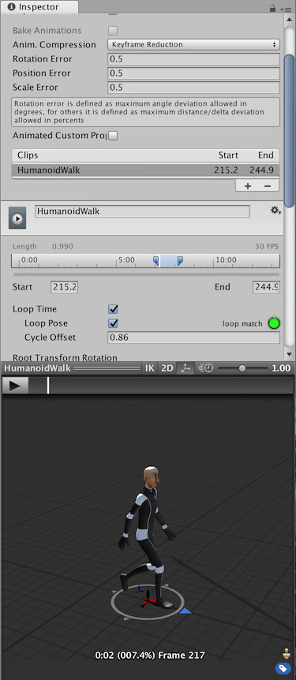
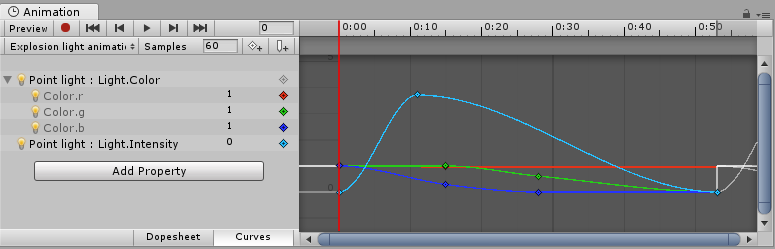

Animation Clips are one of the core elements to Unity’s animation system. Unity supports importing animation from external sources, and offers the ability to create animation clips from scratch within the editor using the Animation window.

动画剪辑是 Unity 动画系统的核心元素之一。
Unity 支持从外部源导入动画，并提供使用“动画”窗口在编辑器中从头开始创建动画剪辑的功能。

## Animation from External Sources

Animation clips imported from external sources could include:

* Humanoid animations captured at a motion capture studio
* Animations created from scratch by an artist in an external 3D application (such as Autodesk® 3ds Max® or Autodesk® Maya®)
* Animation sets from 3rd-party libraries (eg, from Unity’s asset store)
* Multiple clips cut and sliced from a single imported timeline.




从外部源导入的动画剪辑可能包括：
* 在动作捕捉工作室捕捉到的人形动画
* 由艺术家在外部 3D 应用程序（例如 Autodesk® 3ds Max® 或 Autodesk® Maya®）中从头开始创建的动画
* 来自第 3 方库的动画集（例如，来自 Unity 的资源商店）
* 从单个导入的时间轴剪切和切片多个剪辑。

## Animation Created and Edited Within Unity

Unity’s Animation Window also allows you to create and edit animation clips. These clips can animate:

* The position, rotation and scale of GameObjects
* Component properties such as material colour, the intensity of a light, the volume of a sound
* Properties within your own scripts including float, integer, enum, vector and Boolean variables
* The timing of calling functions within your own scripts




Unity 的动画窗口还允许您创建和编辑动画剪辑。这些剪辑可以制作动画：

* 游戏对象的位置、旋转和缩放
* 组件属性，例如材料颜色、光强度、声音音量
* 您自己的脚本中的属性，包括浮点、整数、枚举、向量和布尔变量
* 在您自己的脚本中调用函数的时间

```ad-note

创建动画剪辑，功能丰富啊，可以对组件和材质动画处理。

```