Use the Animation view to preview and edit Animation Clips for animated GameObjects in Unity. To open the Animation view in Unity, go to Window > Animation.


## Viewing Animations on a GameObject

The Animation window is linked to the Hierarchy window, the Project window, the Scene view, and the Inspector window. Like the Inspector, the Animation window shows the timeline and keyframes of the Animation for the currently selected GameObject or Animation Clip Asset. You can select a GameObject using the Hierarchy window or the Scene View, or select an Animation Clip Asset using the Project Window.


## The Animated Properties list


In the image below, the Animation view (left) shows the Animation used by the currently selected GameObject, and its child GameObjects if they are also controlled by this Animation. The Scene view and Hierarchy view are on the right, demonstrating that the Animation view shows the Animations attached to the currently selected GameObject.

```ad-cite

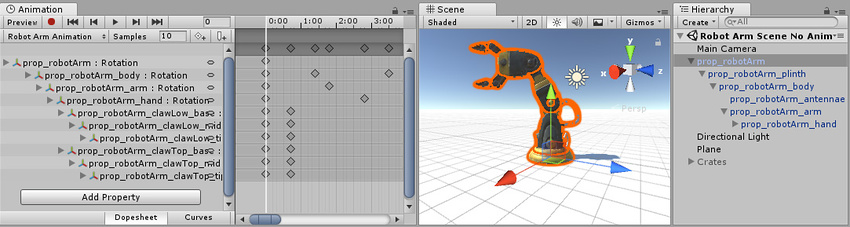

In the left side of the Animation view is a list of the animated properties. In a newly created clip where no animation has yet been recorded, this list is empty.

```
```ad-cite


The Animation view displaying an empty clip. No properties are shown on the left yet.

```

When you begin to animate various properties within this clip, the animated properties will appear here. If the animation controls multiple child objects, the list will also include hierarchical sub-lists of each child object’s animated properties. In the example above, various parts of the Robot Arm’s GameObject hierarchy are all animated within the same animation clip.

When animating a hierarchy of GameObjects within a single clip like this, make sure you create the Animation on the root GameObject in the hierarchy.

Each property can be folded and unfolded to reveal the exact values recorded at each keyframe. The value fields show the interpolated value if the playback head (the white line) is between keyframes. You can edit these fields directly. If changes are made when the playback head is over a keyframe, the keyframe’s values are modified. If changes are made when the playback head is between keyframes (and therefore the value shown is an interpolated value), a new keyframe is created at that point with the new value that you entered.

```ad-cite

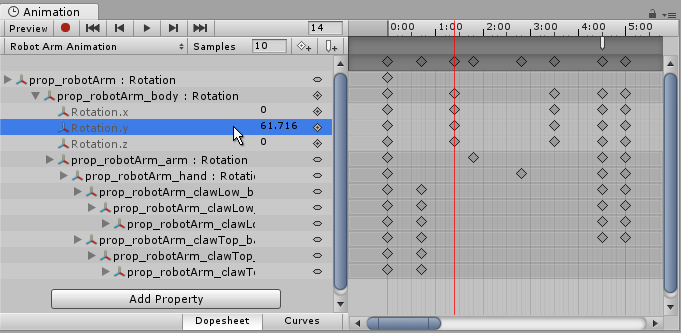

An unfolded property in the Animation View, allowing the keyframe value to be typed in directly. In this image, an interpolated value is shown because the playback head (the white line) is between keyframes. Entering a new value at this point would create a new keyframe.

```


---


## The Animation Timeline

On the right side of the Animation View is the timeline for the current clip. The keyframes for each animated property appear in this timeline. The timeline view has two modes, **Dopesheet** and **Curves**. To toggle between these modes, click **Dopesheet** or **Curves** at the bottom of the animated property list area:

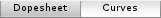

These offer two alternate views of the Animation timeline and keyframe data.


### Dopesheet mode

**Dopesheet** mode offers a more compact view, allowing you to view each property’s keyframe sequence in an individual horizontal track. This allows you to view a simple overview of the keyframe timing for multiple properties or GameObjects.

```ad-cite

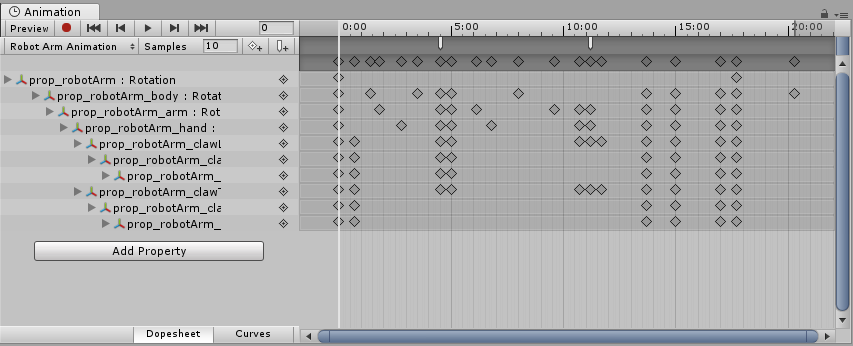

Here the Animation Window is in Dope Sheet mode, showing the keyframe positions of all animated properties within the Animation clip

```

See documentation on Key manipulation in Dopesheet mode for more information.

### Curves mode

**Curves** mode displays a resizable graph containing a view of how the values for each animated property changes over time. All selected properties appear overlaid within the same graph view. This mode allows you to have great control over viewing and editing the values, and how they are interpolated between.

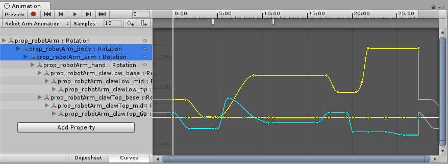

Here, the Animation Window shows the curves for the rotation data of four selected GameObjects within this Animation clip


### Fitting your selection to the window

When using Curves mode to view your Animation, it’s important to understand that sometimes the various ranges for each property can differ greatly. For example, consider a simple Animation clip for a spinning bouncing cube. The bouncing Y position value may vary between the range 0 to 2 (meaning the cube bounces 2 units high during the animation); however, the rotation value goes from 0 to 360 (representing its degrees of rotation). When viewing these two curves at the same time, the animation curves
 for the position values will be very difficult to make out because the view will be zoomed out to fit the 0–360 range of the rotation values within the window:

```ad-cite

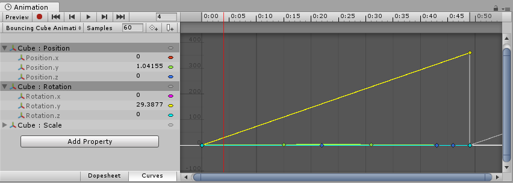

The position and rotation curves of a bouncing spinning cube are both selected, but because the view is zoomed out to fit the 0–360 range of the rotation curve, the bouncing Y position curve is not easily discernible

```


Press F on the keyboard to zoom the view to the currently selected keyframes. This is useful as a quick way to focus and re-scale the window on a portion of your Animation timeline for easier editing.

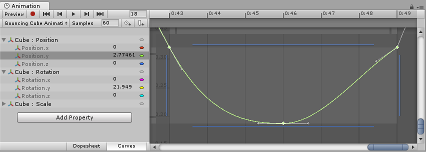

Click on individual properties in the list and press **F** on the keyboard to automatically re-scale the view to fit the range for that value. You can also manually adjust the zoom of the **Curves** window by using the drag handles at each end of the view’s scrollbar sliders. In the image below, the Animation Window is zoomed in to view the bouncing Y position Animation. The start of the yellow rotation curve is still visible, but now extends way off the top of the view:

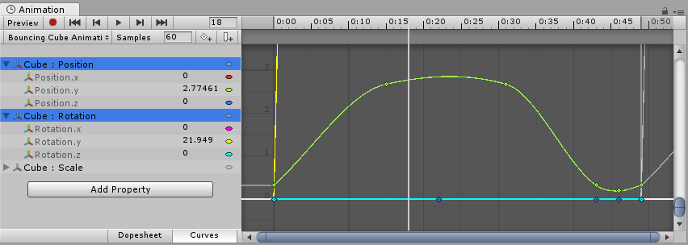

Press **A** on the keyboard to fit and re-scale the window to show all the keyframes in the clip, regardless of which ones are selected. This is useful if you want to view the whole timeline while preserving your current selection:

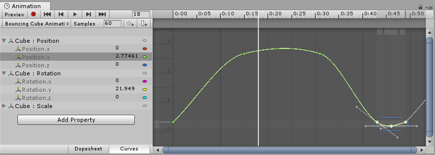

### Playback and frame navigation controls

To control playback of the **Animation Clip**, use the **Playback Controls** at the top left of Animation view.

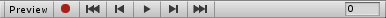

From left-to-right, these controls are:

- Preview mode (toggle on/off).
- Record mode (toggle on/off). Note: Preview mode is on when record mode is on.
- Move playback head to the beginning of the clip.
- Move playback head to the previous keyframe.
- Play Animation.
- Move playback head to the next keyframe.
- Move playback head to the end of the clip.

You can also control the playback head using the following keyboard shortcuts:

- Press Comma (,) to go to the previous frame.
- Press Period (.) to go to the next frame.
- Hold Alt (macOS: Option) and press Comma (,) to go to the previous keyframe.
- Hold Alt (macOS: Option) and press Period (.) to go to the next keyframe.


### Locking the window

You can lock the Animation editor window so that it does not automatically switch to reflect the currently selected GameObject in the Hierarchy or Scene. Locking the window is useful if you want to focus on the Animation for one particular GameObject, and still be able to select and manipulate other GameObjects in the Scene.

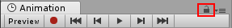

To learn more about navigating the Curve view, see documentation on Using Animation Curves.