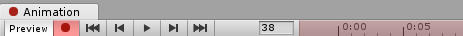
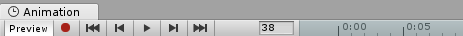
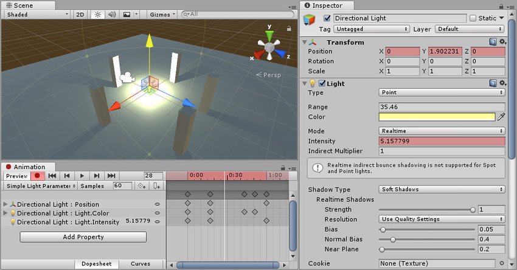
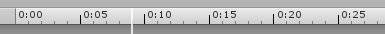
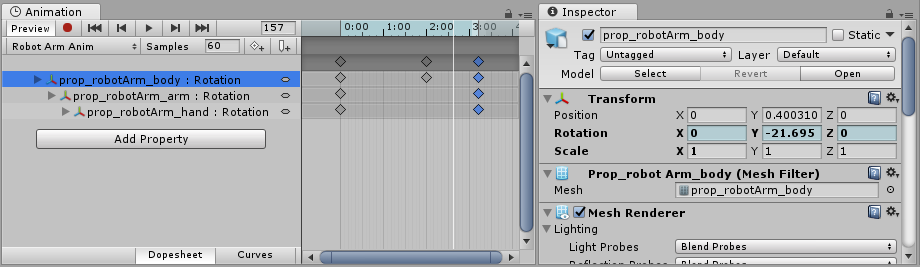
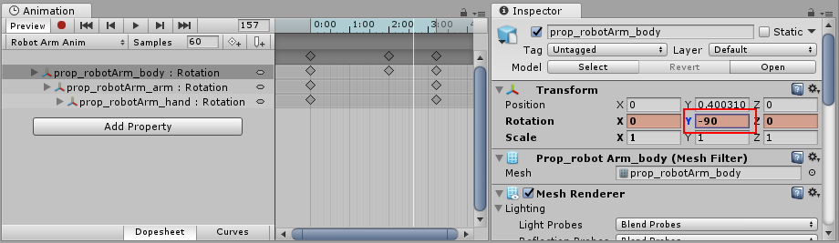
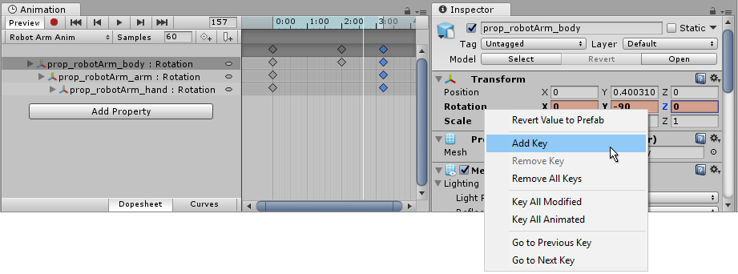
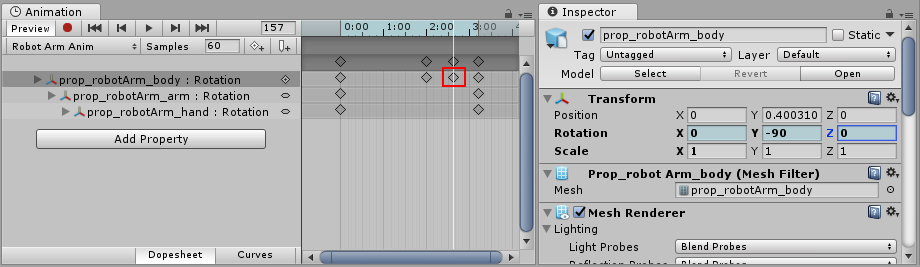

Once you have saved the new Animation clip Asset, you are ready to begin adding keyframes to the clip.

There are two distinct methods you can use to animate GameObjects in the Animation window: Record Mode and Preview Mode.

**Record Mode.** (Also referred to as auto-key mode)

In record mode, Unity automatically creates keyframes at the playback head when you move, rotate, or otherwise modify any animatable property on your animated GameObject. Press the button with the red circle to enable record mode. The Animation window time line is **tinted red** when in record mode.

**Preview Mode:**

In preview mode, modifying your animated GameObject does not automatically create keyframes. You must manually create keyframes (see below) each time you modify your GameObject to a desired new state (for example, moving or rotating it). Press the Preview button to enable preview mode. The Animation window time line is tinted blue when in preview mode.

Note: In record mode, the Preview button is also active, because you are previewing the existing animation and recording new keyframes at the same time.

## Recording keyframes

To begin recording keyframes for the selected GameObject, click on the Animation Record button. This enters Animation Record Mode, where changes to the GameObject are recorded into the Animation Clip.

Once in **Record mode** you can create keyframes by setting the white Playback head to the desired time in the Animation time line, and then modify your GameObject to the state you want it to be at that point in time.

The changes you make to the GameObject are recorded as keyframes at the current time shown by the white line (the playback head) in the Animation Window.

Any change to an animatable property (such as its position or rotation) will cause a keyframe for that property to appear in the Animation window.

Clicking or dragging in the time line bar moves the playback head and shows the state of the animation at the playback head’s current time.

In the screenshot below you can see the Animation window in record mode. The time line bar is tinted red, indicating record mode, and the animated properties show up with a red background in the inspector.

You can stop the **Record Mode** at any time by clicking the **Record button** again. When you stop Record mode, the Animation window switches to **Preview mode**, so that you can still see the GameObject in its current position according to the animation time line.

You can animate any property of the GameObject by manipulating it while in Animation Record Mode. Moving, Rotating or Scaling the GameObject adds corresponding keyframes for those properties in the animation clip. Adjusting values directly in the GameObject’s inspector also adds keyframes while in Record mode. This applies to any animatable property in the inspector, including numeric values, checkboxes, colors, and most other values.

Any properties of the GameObject that are currently animated are shown listed in the left-hand side of the Animation Window. Properties which are not animated are not shown in this window. Any new properties that you animate, including properties on child objects, are added to the property list area as soon as you start animating them.

**Transform** properties are special in that the **.x**, **.y**, and **.z** properties are linked, so curves for all three are added at the same time.

You can also add animatable properties to the current GameObject (and its children) by clicking the **Add Property** button. Clicking this button shows a pop up list of the GameObject’s animatable properties. These correspond with the properties you can see listed in the inspector.

When in Preview mode or Record mode, the white vertical line shows which frame of the Animation Clip is currently previewed. The Inspector and Scene View shows the GameObject at that frame of the Animation Clip. The values of the animated properties at that frame are also shown in a column to the right of the property names.

In Animation Mode a white vertical line shows the currently previewed frame.

### Time line

You can click anywhere on the Animation window time line to move the playback head to that frame, and preview or modify that frame in the Animation Clip. The numbers in the time line are shown as seconds and frames, so 1:30 means 1 second and 30 frames.

Note: The time line appears **tinted blue** when in _Preview_ mode, or **tinted red** when in _Record_ mode.

### Creating keyframes in preview mode

As well as using **Record mode** to automatically create keyframes when you modify a GameObject, you can create keyframes in **Preview mode** by modifying a property on the GameObject, then explicitly choosing to create a keyframe for that property.

In preview mode, animated properties are tinted blue in the Inspector window. When you see this blue tint, it means these values are being driven by the keyframes of the animation clip currently being previewed in the animation window.

If you modify any of these blue-tinted properties while previewing (such as rotating a GameObject that has its rotation property animated, as in the above screenshot) the GameObject is now in a **modified** animation state. This is indicated by a change of color in the tint of the inspector field to a pink color. Because you are not in record mode, your modification is not yet saved as a keyframe.

For example, in the screenshot below, the rotation property has been modified to have a Y value of –90. This modification has not yet been saved as a keyframe in the animation clip.

A modified animated property in preview mode. This change has not yet been saved as a keyframe

In this modified state, you must manually create a keyframe to “save” this modification. If you move the playback head, or switch your selection away from the animated GameObject, you will lose the modification.

### Manually creating keyframes

There are three different ways to manually create a keyframe when you have modified a GameObject in preview mode.

You can add a keyframe by right-clicking the **property label** of the property you have modified, which allows you to either add a keyframe for just that property, or for all animated properties:

When you have added a keyframe, the new keyframe will be visible in the animator window as a diamond symbol (called out in red in the screenshot below), and the property field will return to a blue tint, indicating that your modification is saved as a keyframe, and that you are now previewing a value that is driven by the animation keyframes.

With the new keyframe added (marked in red), the values in the inspector return to a blue tint.

You can also add a keyframe by clicking the **Add Keyframe** button in the Animation window:

#### Hotkeys

- **K** - _Key all animated._ Adds an keyframe for all animated properties at the current position of the playback head in the animation window.
- **Shift-K** - _Key all modified._ Adds an keyframe for only those animated properties which have been modified at the current position of the playback head in the animation window.