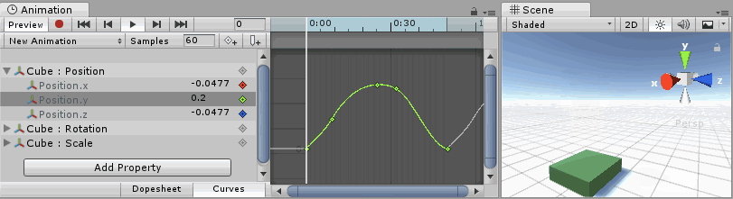
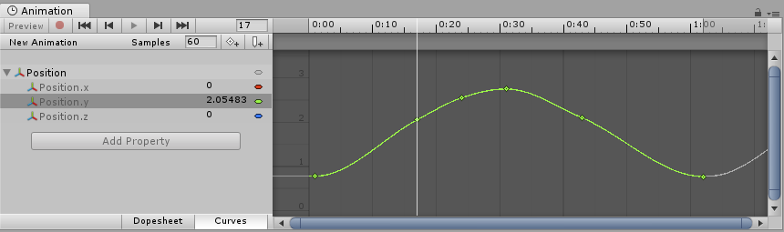
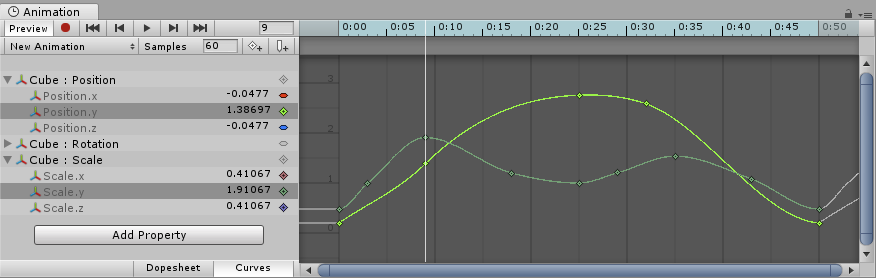
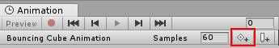
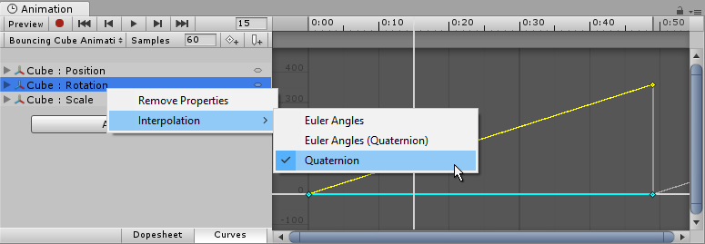
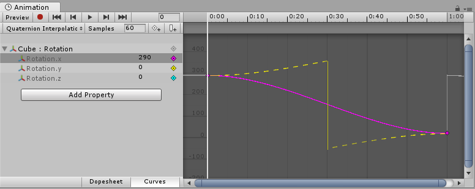

## The Property List

In an Animation Clip, any animatable property can have an Animation Curve, which means that the Animation Clip controls how that property changes over time. In the property list area of the Animation View (on the left), all the currently animated properties are listed. With the Animation View in Dope Sheet mode, the animated values for each property appear only as linear tracks, however in Curves mode you are able to see the changing values of properties visualised as lines on graph. Whichever mode you use to view, the curves still exist - the Dope Sheet mode just gives you a simplified view of the data showing only when the keyframes occur.

In Curves mode, the Animation Curves have colored curve indicators, each colour representing the values for one of the currently selected properties in the property list. For information on how to add curves to an animation property, see the section on Using the Animation View.




## Understanding Curves, Keys and Keyframes

An Animation Curve has multiple keys which are control points that the curve passes through. These are visualized in the Curve Editor as small diamond shapes on the curves. A frame in which one or more of the shown curves have a key is called a keyframe.

If a property has a key in the currently previewed frame, the curve indicator will have a diamond shape, and the property list will also have diamond shapes next to the value.


The **Rotation.y** property has a **key** at the currently previewed frame.

The **Curve Editor** will only show curves for the properties that are selected. If multiple properties are selected in the property list, the curves will be shown overlaid together.


When multiple properties are selected, their curves are shown overlaid together in the Curves Editor


## Adding and Moving Keyframes



You can add a keyframe at the currently previewed frame by clicking the Keyframe button.

A keyframe can be added at the currently previewed frame by clicking the Keyframe button. This will add a keyframe to all currently selected curves. Alternatively you can add a keyframe to a single curve at any given frame by double-clicking the curve where the new keyframe should be. It is also possible to add a keyframe by right-clicking the Keyframe Line and select Add Keyframe from the context menu. Once placed, keyframes can be dragged around with the mouse. It is also possible to select multiple keyframes to drag at once. Keyframes can be deleted by selecting them and pressing Delete, or by right-clicking on them and selecting Delete Keyframe from the context menu.


## Supported Animatable Properties

The Animation View can be used to animate much more than just the position, rotation, and scale of a Game Object. The properties of any Component and Material can be animated - even the public variables of your own scripts components. Making animations with complex visual effects and behaviors is only a matter of adding Animation Curves for the relevant properties.

The following types of properties are supported in the animation system:

- Float
- Color
- Vector2
- Vector3
- Vector4
- Quaternion
- Boolean

Arrays are not supported and neither are structs or objects other than the ones listed above.

For boolean properties, a value of **0** equals **False** while any other value equals **True**.

Here are a few examples of the many things the **Animation View** can be used for:

* Animate the Color and Intensity of a Light to make it blink, flicker, or pulsate.
* Animate the Pitch and Volume of a looping Audio Source to bring life to blowing wind, running engines, or flowing water while keeping the sizes of the sound assets to a minimum.
* Animate the Texture Offset of a Material to simulate moving belts or tracks, flowing water, or special effects.
* Animate the Emit state and Velocities of multiple Ellipsoid Particle Emitters to create spectacular fireworks or fountain displays.
* Animate variables of your own script components to make things behave differently over time.

When using Animation Curves to control game logic, please be aware of the way animations are played back and sampled in Unity.


## Rotation Interpolation Types

In Unity rotations are internally represented as Quaternions. Quaternions consist of .x, .y, .z, and .w values that should generally not be modified manually except by people who know exactly what they’re doing. Instead, rotations are typically manipulated using Euler Angles which have .x, .y, and .z values representing the rotations around those three respective axes.

When interpolating between two rotations, the interpolation can either be performed on the Quaternion values or on the Euler Angles values. The Animation View lets you choose which form of interpolation to use when animating Transform rotations. However, the rotations are always shown in the form of Euler Angles values no matter which interpolation form is used.


Transform rotations can use Euler Angles interpolation or Quaternion interpolation.


### Quaternion Interpolation

Quaternion interpolation always generates smooth changes in rotation along the shortest path between two rotations. This avoids rotation interpolation artifacts such as Gimbal Lock. However, Quaternion interpolation cannot represent rotations larger than 180 degrees, due to its behaviour of always finding the shortest path. (You can picture this by picking two points on the surface of a sphere - the shortest line between them will never be more than half-way around the sphere).

If you use Quaternion interpolation and set the numerical rotation values further than 180 degrees apart, the curve drawn in the animation window will still appear to cover more than a 180 degree range, however the actual rotation of the object will take the shortest path.

```ad-cite



Placing two keys 270 degrees apart when using Quaternion interpolation will cause the interpolated value to go the other way around, which is only 90 degrees. The magenta curve is what is actually shown in the animation window. The true interpolation of the object is represented by the yellow dotted line in this screenshot, but does not actually appear in the editor.

```

When using Quaternion interpolation for rotation, changing the keys or tangents of either the x, y or z curve may also change the values of the other two curves, since all three curves are created from the internal Quaternion representation. When using Quaternion interpolation, keys are always linked, so that creating a key at a specific time for one of the three curves (x, y or z) will also create a key at that time for the other two curves.

### Euler Angles Interpolation

Euler Angles interpolation is what most people are used to working with. Euler Angles can represent arbitrary large rotations and the **.x**, **.y**, and **.z** curves are independent from each other. Euler Angles interpolation can be subject to artifacts such as Gimbal Lock when rotating around multiple axes at the same time, but are intuitive to work with for simple rotations around one axis at a time. When Euler Angles interpolation is used, Unity internally bakes the curves into the Quaternion representation used internally. This is similar to what happens when importing animation into Unity from external programs. Note that this curve baking may add extra keys in the process and that tangents with the **Constant** tangent type may not be completely precise at a sub-frame level.