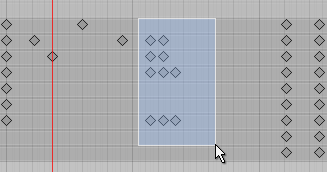
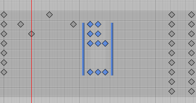
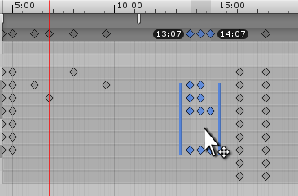
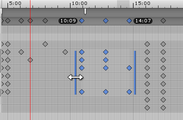

Box Selection is used to select multiple keys while viewing the Animation window in **Dopesheet** mode. This allows you to select and manipulate several keys at once.

The following actions allow you to select multiple keys:

- Hold Shift+click to add individual keys to your selection
- Drag a rectangle with the mouse to select a group of keys
- Hold Shift and drag a rectangle to add or remove group of keys to the current selection

A rectangle dragged across to select multiple keys in **Dopesheet** mode

As you add keys to the selection, Box Selection handles appear on either side of the selected keys. If you add or remove more keys to the selection, the handles automatically adapt their position and size to enclose all the currently selected keys.

Box Selection handles, displayed to the left and right of the selected keys.

Use the Box Selection handles to move, scale and ripple-edit the selected keys (see **Ripple editing**, below).

## Moving selected keys

Click anywhere within the Box Selection handles to drag the selected keys and move them. You do not need to click directly on a key to do this; you can drag by clicking the empty space within the Box Selection handles.

While you drag, the time of first and last key is displayed under the timeline bar to help you place your keys at the desired position. While dragging a selection of keys to the left, any keys that end up at a negative time (that is, to the left of the 0 marker on the timeline) are deleted when you release the mouse button.

Dragging a selection of keys. Note the start and end times of the selection displayed under the top timeline bar.

## Scaling selected keys

When you have multiple keys selected, you can **Scale** the selected keys, either pulling them apart over a longer period of time (making the selected animation slower), or pushing them closer together to occupy a shorter period of time (making the selected animation faster). To scale the selected keys, click and hold either of the blue Box Selection handles at the left and right side of the selected keys, and drag horizontally.

While you scale, the time of first and last key is displayed under the timeline bar to help you scale your keys to the desired position. When scaling a selection of keys down to a smaller amount of time, some keys might end up on the same frame as each other. If this happens, the extra keys that occupy the same frame are discarded when you release the mouse button, and only the last key is kept.

Scaling a selection of keys. Note the start and end times of the selection displayed under the top timeline bar.

## Ripple editing

Ripple editing is a method of moving and scaling selected keys. This method also affects non-selected keys on the same timeline as the keys that you are manipulating. The name refers to having the rest of your content automatically move along the timeline to accommodate content you have added, expanded or shrunk. The effects of your edit have a “ripple effect” along the whole timeline.

Press and hold the **R** key while dragging inside the Box Selection to perform a **Ripple Move**. This has the effect of “pushing” any unselected keys, plus the original amount of space between your selection and those keys, to the left or right of your selection when you drag the selected keys along the timeline.

Press and hold the **R** key while dragging a Box Selection handle to perform a **Ripple Scale**. The effect on the rest of the unselected keys in the timeline is exactly the same as with a Ripple Move - they are pushed to the left or right as you scale to the left or right side of your Box Selection.