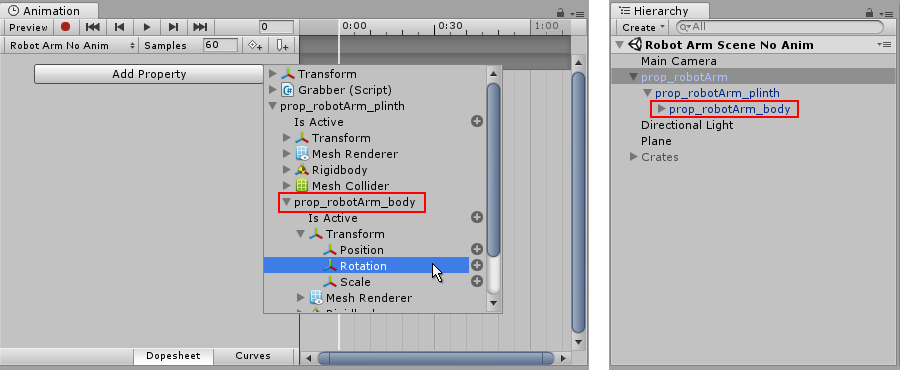

You may want to animate **Game Objects** that have multiple moving parts, such as a gun turret with a moving barrel, or a character with many body parts. All the parts can be animated by a single Animation component on the parent, although it is useful to have additional Animation components on the children in some cases.

## Animating Child Game Objects

The Game Object hierarchy is shown in the panel to the left of the **Animation View**.

You can access the children of a Game Object by using the foldout triangle next to the object’s name. The properties of child objects can be animated just like those of the parent.

Child **Game Objects** appear in the list of animatable properties when pressing the Add Curve button. They can be expanded to view the animatable properties on those child Game Objects__Animation View__.

Alternatively you can select just the child Game Object you want to animate from the Hierarchy panel or the scene view, and manipulate the object or change its properties in the inspector, while in animation recording mode.
