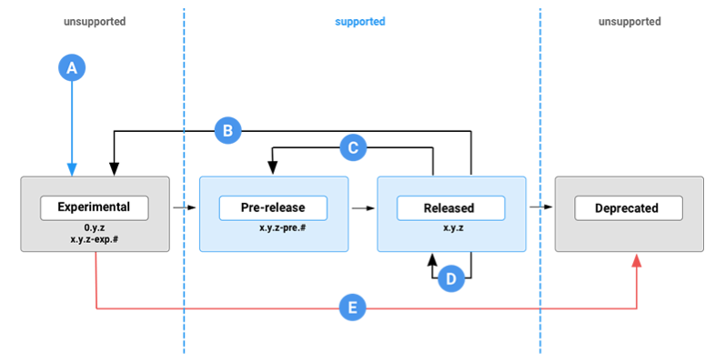

Starting from Unity Editor version 2021.1, a package can travel through the following states during its lifecycle:



The Package Manager window displays a label that corresponds to some of these states.

Note: These package states only apply to packages that Unity develops internally. Contact third-party package developers to ask about their specific processes.

```ad-note

unity包生命周期，学它的打标签方式。

`0.y.z` / `x.y.z-exp`  => `x.y.z-pre` => `x.y.z` => deprecated

```

从 Unity 编辑器版本 2021.1 开始，包在其生命周期中可以经历以下状态：

包管理器窗口显示与其中一些状态相对应的标签。

注意：这些包​​状态仅适用于 Unity 内部开发的包。联系第三方包开发者询问他们的具体流程。


---

## Birth (A)

While the package developer creates the package, it’s in the Custom state.

When it’s ready for Unity users to test it and provide feedback, a package enters the Experimental state. Unity doesn’t support experimental packages and doesn’t guarantee that experimental packages will be fully released and verified to be safe to use in production until they enter the release track.

Experimental packages either use 0 as the major part of their version or the -exp.# suffix on the patch part of their version. For example, mypackage@0.1.2 or mypackage@1.2.3-exp.1.

当包开发人员创建包时，它处于自定义状态。

当 Unity 用户准备好测试它并提供反馈时，包就会进入实验状态。 Unity 不支持实验包，并且不保证实验包在进入发布轨道之前将被完全发布并验证可在生产中安全使用。

实验包要么使用 0 作为其版本的主要部分，要么使用 -exp.# 后缀作为其版本的补丁部分。例如，`mypackage@0.1.2` 或 `mypackage@1.2.3-exp.1`


---

## Release track

When a package passes quality testing and contains no experimental features or functionality (including dependencies on experimental packages), it enters the Pre-release state, which is on the release track. Unity fully supports packages on the release track and commits to officially releasing them by the end of the current LTS cycle (for example, 2021.3) at the latest. For a list of pre-release packages available for this version, refer to Pre-release packages.

Unity’s release management only grants a package the Released status after it passes several testing stages and validation procedures, which also include checks for appropriate documentation, changelog, and license files. Packages in this state never use non-numeric suffixes as part of their version. For a list of released packages available for this version, refer to Released packages.

If the package developer updates or changes a released package, that package might return to another state depending on the severity:

| **Phase** | **Type of change**                                                                                            | **New state**         | **Version bump**       |
| --------- | ------------------------------------------------------------------------------------------------------------- | --------------------- | ---------------------- |
| **(B)**   | Major API change that breaks an API<br><br>破坏 API 的主要 API 更改                                                  | Experimental          | `1.2.3` => `2.0.0-exp` |
| **(C)**   | Minor API change that doesn’t break the API but affects usage.<br><br>较小的 API 更改不会破坏 API 但会影响使用               | Pre-release           | `1.2.3` => `1.3.0-pre` |
| **(D)**   | Bug fixes, trivial changes, and documentation updates typical of patch updates.<br><br>补丁更新中典型的错误修复、细微更改和文档更新 | Released (same state) | `1.2.3` => `1.2.4`     |

```ad-note

发布包：
不包含实验性特性或功能；
经过多次测试阶段和验证后，才能发布；

```

当包通过质量测试并且不包含实验性特性或功能（包括对实验性包的依赖）时，它会进入预发布状态，即处于发布轨道上。 Unity 完全支持发布轨道上的软件包，并承诺最迟在当前 LTS 周期结束时（例如 2021.3）正式发布它们。有关此版本可用的预发行包的列表，请参阅预发行包。

Unity 的发布管理仅在包通过多个测试阶段和验证过程后才授予包“已发布”状态，其中还包括检查适当的文档、变更日志和许可证文件。这种状态下的包从不使用非数字后缀作为其版本的一部分。有关此版本可用的已发布软件包的列表，请参阅已发布的软件包。

如果包开发人员更新或更改已发布的包，则该包可能会返回到另一个状态，具体取决于严重性：


---

## Death (E)

Packages that reach their end of life are no longer supported in Editors where they’re marked Deprecated. Avoid using packages in a Deprecated state because they might be nonfunctional or unsafe.

For more information, refer to Deprecated packages.

Some experimental packages go directly to the deprecated state without passing through the release cycle track.

```ad-note

不要使用 已经弃用的包

```

已达到生命周期终点的软件包在编辑器中不再受支持，它们被标记为“已弃用”。避免使用处于“已弃用”状态的包，因为它们可能无法正常工作或不安全。

有关详细信息，请参阅已弃用的包。

一些实验包直接进入弃用状态，而不经过发布周期轨道。

---