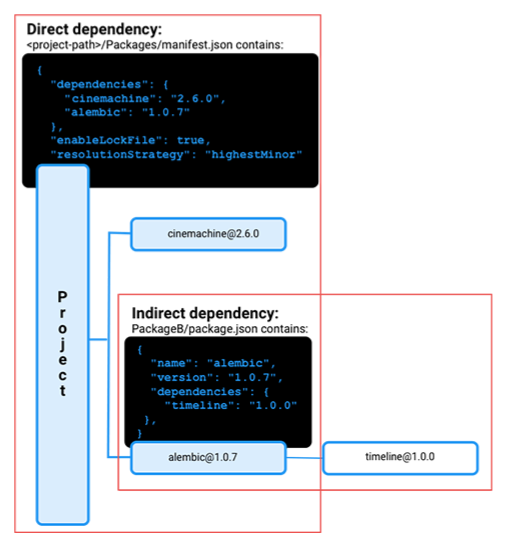
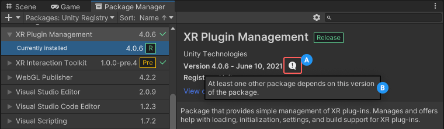

The concept of dependencies is fundamental to Unity’s Package Manager behavior.

A dependency is a package that your project or another package needs to work.

依赖关系的概念是 Unity 包管理器行为的基础。

依赖项是您的项目或其他包运行所需的包。

---

When you work in the Package Manager window, you can install a package from several sources (a registry, a local folder or tarball, a Git URL, and by name). However, while the Package Manager installs packages from these sources seamlessly, it first has to make a series of calculations to decide which version to install. It also has to decide which other packages and versions to install to support the package you selected.

当您在“包管理器”窗口中工作时，您可以从多个源（注册表、本地文件夹或 tarball、Git URL 和按名称）安装包。然而，虽然包管理器无缝地安装来自这些源的包，但它首先必须进行一系列计算来决定安装哪个版本。它还必须决定安装哪些其他软件包和版本来支持您选择的软件包。

---

#### Direct dependencies

When you select a package version to install through the Package Manager window, you are adding a “dependency” to your project manifest. This is a declaration that you need a specific version of a particular package in order for the project to work. To add a dependency to your project, you add a reference to the package and version in the form package-name@package-version to the dependencies property of the `<project-root>/Packages/manifest.json` file. These are called “direct” dependencies because your project directly depends on them.

```ad-note

直接依赖 在包管理窗口中添加，添加到manifest中

```

当您通过“包管理器”窗口选择要安装的包版本时，您将向项目清单添加“依赖项”。这是一个声明，表明您需要特定包的特定版本才能使项目正常运行。要向项目添加依赖项，请以 `package-name@package-version` 的形式将对包和版本的引用添加到 `<project-root>/Packages/manifest.json` 文件的依赖项属性中。这些称为“直接”依赖项，因为您的项目直接依赖于它们。

---

#### Indirect dependencies

Packages can also require other packages to work. These are called “indirect” (or transitive) dependencies. The package developer adds these to the dependencies property of the package manifest file during development (`<package-root>/package.json`). For example, in the diagram below, the alembic@1.0.7 package has a dependency on the timeline@1.0.0 package, so the timeline package is an “indirect” dependency. Conversely, the project has dependencies on the cinemachine@2.6.0 and alembic@1.0.7 packages, so those are both “direct” dependencies.


A diagram showing both direct and indirect dependencies

```ad-note

间接依赖，很多在每个包里，写在package.json中

```

软件包还可能需要其他软件包才能工作。这些称为“间接”（或传递）依赖关系。包开发人员在开发过程中将它们添加到包清单文件 (`<package-root>/package.json`) 的依赖项属性中。例如，在下图中，alembic@1.0.7包依赖于timeline@1.0.0包，因此timeline包是“间接”依赖项。相反，该项目依赖于 cinemachine@2.6.0 和 alembic@1.0.7 包，因此它们都是“直接”依赖项。


---

#### Version overrides

When you add a package version as a dependency, that version isn’t necessarily the version that the Package Manager installs. The reason is because the Package Manager has to consider all dependencies in your project, whether direct or indirect. In the following example, the XR Plugin Management package requested was version 4.0.3. However, the Package Manager installed version 4.0.6 because another package depended on the higher version, as indicated in the information message (B):

```ad-cite



When you click the information button in the details panel (A), a text box appears (B) explaining why this version was installed instead of the one you requested.

当您单击详细信息面板 (A) 中的信息按钮时，会出现一个文本框 (B)，解释为什么安装此版本而不是您请求的版本。

```

```ad-note

包管理器，会根据全局需要的依赖版本，选择实际版本，会发生 版本重写。

```

当您添加软件包版本作为依赖项时，该版本不一定是软件包管理器安装的版本。原因是包管理器必须考虑项目中的所有依赖项，无论是直接的还是间接的。在以下示例中，请求的 XR 插件管理包是版本 4.0.3。但是，包管理器安装了版本 4.0.6，因为另一个包依赖于更高版本，如信息消息 (B) 中所示：


---

#### Dependency graph

The Package Manager can install only one package version at a time, so it has to construct a dependency graph. This graph is a list of every direct and indirect dependency for the project. The dependency graph determines which version of each package to install.

```ad-note

依赖关系图，不要出现循环依赖。

```

包管理器一次只能安装一个包版本，因此它必须构建一个依赖关系图。该图是项目的每个直接和间接依赖项的列表。依赖关系图确定要安装每个包的版本。

---

#### Lock file

When the Package Manager resolves all version conflicts, it saves the resolution in a lock file for two reasons:

* Determinism, to make sure that the same packages are reliably installed every time.
* Efficiency, to reduce the amount of time and resources it takes to compute the dependency graph again.

```ad-note

Lock file 将解决版本冲突的结果 存储。

```

当包管理器解决所有版本冲突时，它会将解决方案保存在锁定文件中，原因有两个：

* 确定性，确保每次都可靠地安装相同的软件包。
* 效率，减少再次计算依赖图所需的时间和资源。

---