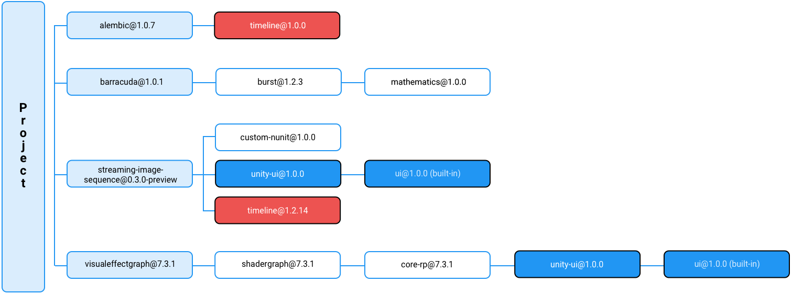
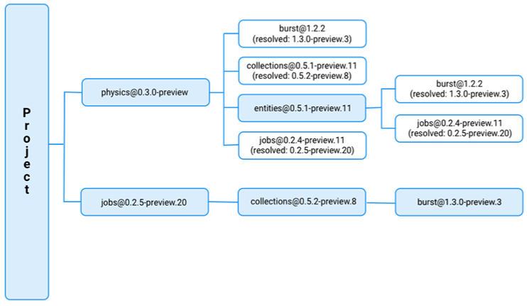

When you add a package to a project manifest, Unity considers that package a dependency of the project (a direct dependency). However, a package can also have dependencies on other packages, which create indirect dependencies in any projects that require that package.

Since most projects require more than one package in order to develop games and apps, the Package Manager has to evaluate all the requested package versions to retrieve from the registry (whether direct or indirect), and decide which among those package versions to install. To do this, it computes the set of packages that satisfies all direct and indirect dependencies in the project, starting with the project dependencies and recursively exploring each indirect dependency, collecting all the dependency information, then picking a set of packages that satisfies the dependency requirements without any conflict. For example, this dependency graph represents a project with four direct dependencies and all of their indirect dependencies:

当您将包添加到项目清单时，Unity 会将该包视为项目的依赖项（直接依赖项）。但是，包也可以依赖于其他包，这会在需要该包的任何项目中创建间接依赖关系。

由于大多数项目需要多个包才能开发游戏和应用程序，因此包管理器必须评估所有请求的包版本以从注册表中检索（无论是直接还是间接），并决定安装这些包版本中的哪一个。为此，它计算满足项目中所有直接和间接依赖项的包集，从项目依赖项开始，递归地探索每个间接依赖项，收集所有依赖项信息，然后选择一组满足依赖项要求且没有任何冲突的包。例如，此依赖关系图表示具有四个直接依赖关系及其所有间接依赖关系的项目：


```ad-cite



A graph of direct and indirect package dependencies for a project

```

In this example:

- The light blue nodes represent the project’s direct dependencies.
- The dark blue nodes show the same package and version as indirect dependencies in this project.
- The red nodes show two different versions of the same package, which is a conflict.

Note: Only package dependencies declared with versions need to be resolved. The Package Manager selects packages installed from other sources, such as embedded packages, and dependencies declared with local paths, Git URLs, and built-in packages over version-based dependencies.

在这个例子中：

* 浅蓝色节点代表项目的直接依赖项。
* 深蓝色节点显示与此项目中的间接依赖项相同的包和版本。
* 红色节点显示同一包的两个不同版本，这是冲突的。

注意：仅需要解析使用版本声明的包依赖项。包管理器选择从其他来源安装的包，例如嵌入式包、使用本地路径声明的依赖项、Git URL 以及基于版本的依赖项的内置包。

---


## Choosing the best solution

Depending on the set of packages defined in the project manifest, it could take a long time to evaluate all possible package combinations: a project could potentially depend on hundreds of packages, each of which depend on hundreds of other packages, most requiring different versions.

根据项目清单中定义的包集，可能需要很长时间来评估所有可能的包组合：一个项目可能依赖于数百个包，每个包又依赖于数百个其他包，其中大多数包需要不同的版本。

---

### Lock files and resolutionStrategy

To provide the most efficient solution, the Package Manager prioritizes package versions that it previously used by tracking them in a lock file. This guarantees that subsequent dependency resolution using the same inputs results in the same outputs. It also minimizes time-consuming operations such as downloading, extracting, or copying packages.

Sometimes, the Package Manager cannot find a solution that only includes locked packages. In this case, the Package Manager uses the solution with the least risky upgrades, preferring patch upgrades over minor or major upgrades, and minor upgrades over major upgrades by default. However, you can customize how aggressive you want the Package Manager to be when considering a higher version with the resolutionStrategy property.

```ad-note

当找不到lock package时，使用风险最小的升级解决方案，比如升级。

```

为了提供最有效的解决方案，包管理器通过在锁定文件中跟踪以前使用的包版本来确定其优先级。这保证了使用相同输入的后续依赖性解析会产生相同的输出。它还最大限度地减少了下载、解压或复制包等耗时的操作。

有时，包管理器找不到仅包含锁定包的解决方案。在这种情况下，程序包管理器使用风险最小的升级解决方案，默认情况下优先选择补丁升级而不是次要或主要升级，并且优先选择次要升级而不是主要升级。但是，在考虑使用分辨率策略属性的更高版本时，您可以自定义包管理器的积极程度。

---

## Example

In this example, there are multiple versions of the following packages requested:

- `burst@1.2.2` (twice) and `burst@1.3.0-preview.3`
- `collections@0.5.1-preview.11` and `collections@0.5.2-preview.8`
- `jobs@0.2.4-preview.11` (twice) and `jobs@0.2.5-preview.20`

Using the set of direct and indirect dependencies, the Package Manager selects the highest version of the burst package (burst@1.3.0-preview.3), which satisfies the collections@0.5.2-preview.8 package’s dependency:




在此示例中，请求了以下包的多个版本：
- `burst@1.2.2` (twice) and `burst@1.3.0-preview.3`
- `collections@0.5.1-preview.11` and `collections@0.5.2-preview.8`
- `jobs@0.2.4-preview.11` (twice) and `jobs@0.2.5-preview.20`

使用直接和间接依赖项集，包管理器选择burst包的最高版本（burst@1.3.0-preview.3），它满足collections@0.5.2-preview.8包的依赖项：

---