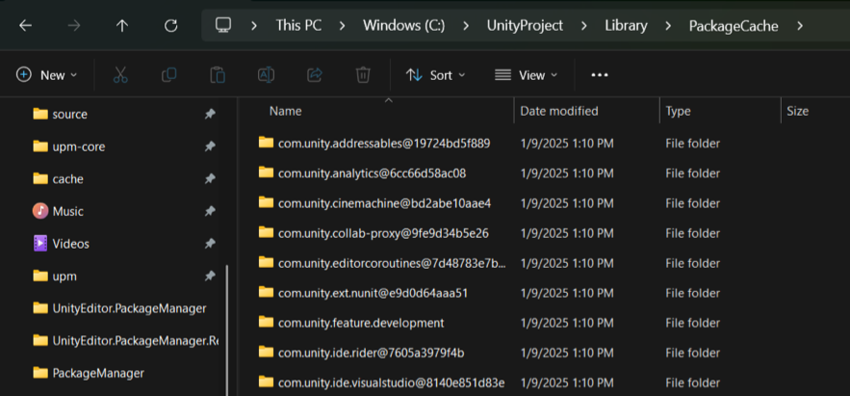

Any package that appears under your project’s Packages folder is embedded in that project. You can create an embedded package in several ways:

* Create a new package directly in your project’s Packages folder.
* Manually copy a Unity package from the project’s package cache into your project’s Packages folder.
* Use a C# script to embed a version of a package that’s already installed.

Embedded packages don’t need to appear in the project manifest as a dependency. However, if you embedded a version of an installed package, your project manifest still lists the dependency on the original installed version. In that case, the package on disk takes priority over the version of the package listed as a dependency, so it doesn’t need to be removed from the project manifest. For example, if the project manifest specifies a dependency on version 1.3.1 of the com.unity.example package but the project also has an embedded package with that name, the Package Manager uses the embedded package, regardless of its apparent version, instead of downloading version 1.3.1 from the registry.

Make sure you track the contents of your embedded packages, and any changes you make to it. If your Unity project is under source control, add any packages embedded in that project to the same source control.

```ad-note

embedded package 可以手动或者脚本 直接放进 Packages文件夹。

```

项目的 Packages 文件夹下出现的任何包都嵌入到该项目中。您可以通过多种方式创建嵌入式包：

* 直接在项目的 Packages 文件夹中创建一个新包。
* 手动将 Unity 包从项目的包缓存复制到项目的 Packages 文件夹中。
* 使用 C# 脚本嵌入已安装的软件包版本。

嵌入式包不需要作为依赖项出现在项目清单中。但是，如果您嵌入了已安装包的某个版本，您的项目清单仍会列出对原始安装版本的依赖项。在这种情况下，磁盘上的包优先于列为依赖项的包的版本，因此不需要从项目清单中删除它。例如，如果项目清单指定对 com.unity.example 包版本 1.3.1 的依赖项，但该项目还有一个具有该名称的嵌入式包，则包管理器将使用该嵌入式包（无论其表面版本如何），而不是从注册表下载版本 1.3.1。

确保跟踪嵌入包的内容以及对其所做的任何更改。如果您的 Unity 项目受源代码管理，请将嵌入该项目的所有包添加到同一源代码管理中。

---


## Creating a new custom package

To embed a new package, create your new package content inside a folder under the Packages folder. For more information, follow the instructions for creating your own custom package.

Typically, your new package remains embedded in your project until you are ready to share it with other users and test it in other projects. You can use different methods to share your package, for example, you can host the package on a scoped registry.

要嵌入新包，请在 Packages 文件夹下的文件夹中创建新包内容。有关更多信息，请按照创建您自己的自定义包的说明进行操作。

通常，您的新包会一直嵌入您的项目中，直到您准备好与其他用户共享它并在其他项目中对其进行测试。您可以使用不同的方法来共享包，例如，您可以将包托管在作用域注册表上。


---


## Copying a Unity package from the cache

A package installed from a registry is immutable, which means you can’t edit it. If you want to edit a package, you can make it mutable by copying it to the Packages subfolder in your Projects folder. This package type is called an embedded package, and it overrides what’s in your package cache. Later, you can delete that embedded package’s folder from the Packages subfolder, and the Package Manager will automatically change to the immutable, cached package.

**Important**: Unity supports the following procedure for creating an embedded package only. Accessing the package cache folder for any other purpose is discouraged and not supported by Unity. Don’t manipulate the contents of the package cache folder.

```ad-note

从注册表安装的packge，是无法编辑，不推荐编辑的，不要去动包缓存文件夹。

```

从注册表安装的包是不可变的，这意味着您无法编辑它。如果要编辑包，可以通过将其复制到项目文件夹中的 Packages 子文件夹来使其可变。这种包类型称为嵌入式包，它会覆盖包缓存中的内容。稍后，您可以从 Packages 子文件夹中删除该嵌入包的文件夹，包管理器将自动更改为不可变的缓存包。

重要提示：Unity 仅支持以下创建嵌入式包的过程。 Unity 不鼓励也不支持出于任何其他目的访问包缓存文件夹。不要操纵包缓存文件夹的内容。


To find your package’s folder in the cache, locate the installed version directly in the Unity Editor:

1. Open the Project window by opening the Window menu and selecting General > Project.
2. From the Project window, find the installed package you want to embed.
3. Right-click the folder of the selected package and select Show in Explorer (Windows) or Reveal in Finder (macOS). That package’s folder opens directly in a file browser and uses the `<package-name>@<fingerprint>` naming convention.
4. Copy the package folder and paste it directly into your project’s Packages subfolder, not the Packages root folder. Don’t put it inside the Assets folder, because the Package Manager doesn’t scan that folder for packages.
5. Remove the `@<fingerprint>` part of the folder name.
6. Add the newly embedded package to source control if your project is already under source control.


```ad-cite



File browser opened to the package folder under the project’s package cache

```

If you want to delete the embedded package, use your file browser or command line to locate that package in your `Packages` folder. Consider backing up the folder for the embedded package, otherwise you’ll lose any changes you made to the package. Then, delete the folder for that package from your `Packages` folder. The Package Manager will automatically revert to the immutable, cached package.


要在缓存中查找包的文件夹，请直接在 Unity 编辑器中找到已安装的版本：

1. 通过打开“窗口”菜单并选择“常规”>“项目”来打开“项目”窗口。
2. 从“项目”窗口中，找到要嵌入的已安装包。
3. 右键单击所选包的文件夹，然后选择在资源管理器中显示 (Windows) 或在 Finder 中显示 (macOS)。该包的文件夹直接在文件浏览器中打开，并使用 `<package-name>@<fingerprint>` 命名约定。
4. 复制包文件夹并将其直接粘贴到项目的 Packages 子文件夹中，而不是 Packages 根文件夹中。不要将其放在 Assets 文件夹中，因为包管理器不会扫描该文件夹中的包。
5. 删除文件夹名称的 `@<fingerprint>` 部分。
6. 如果您的项目已处于源代码管理之下，则将新嵌入的包添加到源代码管理中。

如果要删除嵌入的包，请使用文件浏览器或命令行在 Packages 文件夹中找到该包。请考虑备份嵌入包的文件夹，否则您将丢失对包所做的任何更改。然后，从 Packages 文件夹中删除该包的文件夹。包管理器将自动恢复为不可变的缓存包。


---