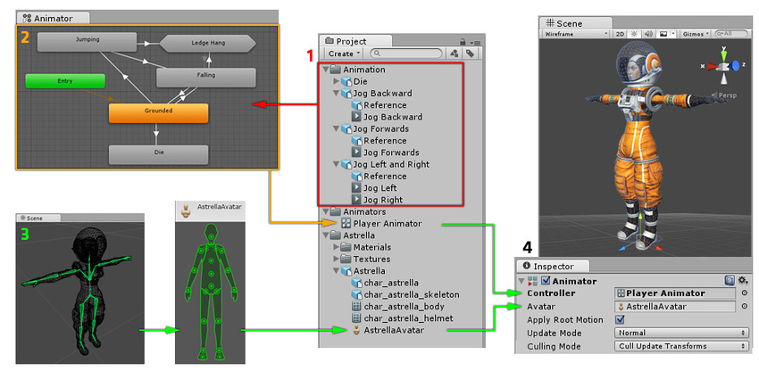

Unity has a rich and sophisticated animation system (sometimes referred to as ‘**Mecanim**’). It provides:
- Easy workflow and setup of animations for all elements of Unity including objects, characters, and properties.
- Support for imported animation clips and animation created within Unity.
- Humanoid animation retargeting the ability to apply animations from one character model onto another.
- Simplified workflow for aligning animation clips.
- Convenient preview of animation clips, transitions and interactions between them. This allows animators to work more independently of programmers, prototype and preview their animations before gameplay code is hooked in.
- Management of complex interactions between animations with a visual programming tool.
- Animating different body parts with different logic.
- Layering and masking features

Unity 拥有丰富而复杂的动画系统（有时称为“Mecanim”）。它提供：

* 适用于 Unity 所有元素（包括对象、角色和属性）的简单工作流程和动画设置。
* 支持导入的动画剪辑和在 Unity 中创建的动画
* 人形动画重定向 - 将动画从一个角色模型应用到另一个角色模型的能力。
* 简化了对齐动画剪辑的工作流程。
* 方便预览动画剪辑、过渡以及它们之间的交互。这使得动画师能够更加独立于程序员进行工作，在游戏代码插入之前制作原型并预览动画。
* 使用可视化编程工具管理动画之间的复杂交互。
* 用不同的逻辑来动画不同的身体部位。
* 分层和遮罩功能

---

## Animation workflow

Unity’s animation system is based on the concept of Animation Clips, which contain information about how certain objects should change their position, rotation, or other properties over time. Each clip can be thought of as a single linear recording. Animation clips from external sources are created by artists or animators with 3rd party tools such as Autodesk® 3ds Max® or Autodesk® Maya®, or come from motion capture studios or other sources.

Unity 的动画系统基于动画剪辑的概念，其中包含有关某些对象应如何随时间改变其位置、旋转或其他属性的信息。每个剪辑都可以被视为单个线性录音。来自外部来源的动画剪辑由艺术家或动画师使用 Autodesk® 3ds Max® 或 Autodesk® Maya® 等第三方工具创建，或者来自动作捕捉工作室或其他来源。

Animation Clips are then organised into a structured flowchart-like system called an Animator Controller. The Animator Controller acts as a “State Machine” which keeps track of which clip should currently be playing, and when the animations should change or blend together.

然后，动画剪辑被组织成一个类似流程图的结构化系统，称为动画控制器。动画控制器充当“状态机”，跟踪当前应播放哪个剪辑，以及动画何时应更改或混合在一起。

A very simple Animator Controller might only contain one or two clips, for example to control a powerup spinning and bouncing, or to animate a door opening and closing at the correct time. A more advanced Animator Controller might contain dozens of humanoid animations for all the main character’s actions, and might blend between multiple clips at the same time to provide a fluid motion as the player moves around the scene.

一个非常简单的动画控制器可能只包含一两个剪辑，例如控制电源旋转和弹跳，或者在正确的时间制作门打开和关闭的动画。更高级的动画控制器可能包含数十个用于所有主要角色动作的人形动画，并且可能同时在多个剪辑之间混合，以在玩家在场景中移动时提供流畅的运动。

```ad-note

Animator Controller 作为状态机，控制播放不同 Animation Clips

```

Unity’s Animation system also has numerous special features for handling humanoid characters which give you the ability to retarget humanoid animation from any source (for example: motion capture; the Asset Store; or some other third-party animation library) to your own character model, as well as adjusting muscle definitions. These special features are enabled by Unity’s Avatar system, where humanoid characters are mapped to a common internal format.

Unity 的动画系统还具有许多用于处理人形角色的特殊功能，使您能够将来自任何来源（例如：动作捕捉、Asset Store 或某些其他第三方动画库）的人形动画重新定位到您自己的角色模型，以及调整肌肉定义。这些特殊功能由 Unity 的 Avatar 系统启用，其中人形角色被映射到通用的内部格式。

```ad-note

Unity Avatar 系统等，可以处理人形动画

```

Each of these pieces - the Animation Clips, the Animator Controller, and the Avatar, are brought together on a GameObject via the Animator Component. This component has a reference to an Animator Controller, and (if required) the Avatar for this model. The Animator Controller, in turn, contains the references to the Animation Clips it uses.

其中每一个部分 - 动画剪辑、动画控制器和Avatar，都通过动画组件组合在一个游戏对象上。该组件引用了 Animator Controller，以及（如果需要）该模型的 Avatar。动画控制器又包含对其使用的动画剪辑的引用。

```ad-note

Animator组件，引用AnimatorController/Avatar等 将动画组合到游戏物体上。

```

The above diagram shows the following:
1. Animation clips are imported from an external source or created within Unity. In this example, they are imported motion captured humanoid animations.
2. The animation clips are placed and arranged in an Animator Controller. This shows a view of an Animator Controller in the Animator window. The States (which may represent animations or nested sub-state machines) appear as nodes connected by lines. This Animator Controller exists as an asset in the Project window.
3. The rigged character model (in this case, the astronaut “Astrella”) has a specific configuration of bones which are mapped to Unity’s common Avatar format. This mapping is stored as an Avatar asset as part of the imported character model, and also appears in the Project window as shown.
4. When animating the character model, it has an Animator component attached. In the Inspector view shown above, you can see the Animator Component which has both the Animator Controller and the Avatar assigned. The animator uses these together to animate the model. The Avatar reference is only necessary when animating a humanoid character. For other types of animation, only an Animator Controller is required.

Unity’s animation system comes with a lot of concepts and terminology. If at any point, you need to find out what something means, go to our Animation Glossary.

```ad-cite



```

上图显示了以下内容：
1. 动画剪辑是从外部源导入或在 Unity 中创建的。在此示例中，它们是导入的动作捕捉人形动画。
2. 动画剪辑被放置并排列在动画控制器中。这显示了动画器窗口中动画器控制器的视图。状态（可能表示动画或嵌套子状态机）显示为由线连接的节点。该动画控制器作为项目窗口中的资产存在。
3. 已装配的角色模型（在本例中为宇航员“Astrella”）具有特定的骨骼配置，这些骨骼被映射到 Unity 的通用 Avatar 格式。此映射作为导入角色模型的一部分存储为 Avatar 资源，并且也显示在“项目”窗口中，如图所示。
4. 当对角色模型进行动画处理时，它会附加一个 Animator 组件。在上面显示的检查器视图中，您可以看到动画器组件，它同时分配了动画器控制器和头像。动画师将它们一起使用来为模型制作动画。仅当制作人形角色动画时才需要 Avatar 参考。对于其他类型的动画，只需要一个动画控制器。

Unity的动画系统带有很多概念和术语。如果您在任何时候需要了解某些内容的含义，请访问我们的动画术语表。


---
## Legacy animation system

While Mecanim is recommended for use in most situations, Unity includes its legacy animation system which existed before Unity 4. You may need to use the legacy animation system when working with older content created before Unity 4. For information on the Legacy animation system, see this section

虽然建议在大多数情况下使用 Mecanim，但 Unity 包含在 Unity 4 之前存在的旧版动画系统。在处理 Unity 4 之前创建的旧内容时，您可能需要使用旧版动画系统。有关旧版动画系统的信息，请参阅本节