There are several different features and windows in the Unity Editor which use **Curves** to display and edit data. The methods you can use to view and manipulate curves is largely the same across all these areas, although there are some exceptions.

* The Animation Window uses curves to display and edit the values of animated properties over time in an Animation Clip.

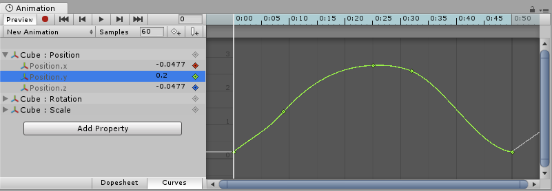

* Script components can have member variables of type Animation Curve that can be used for all kinds of things. Clicking on those in the Inspector will open up the Curve Editor.

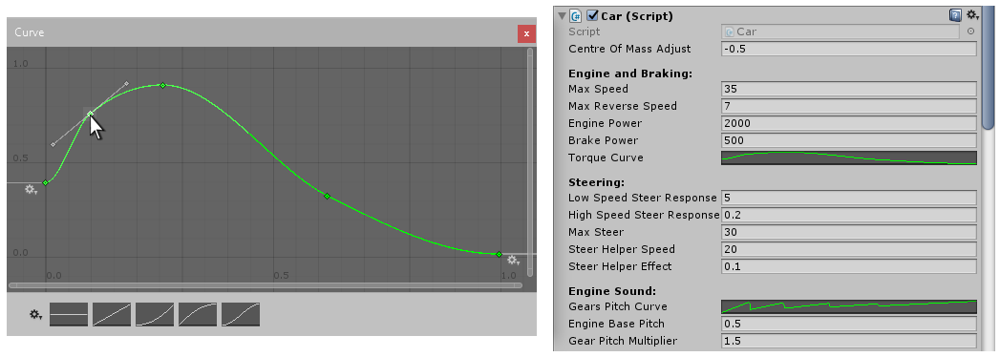

* The Audio Source component uses curves to control roll-off and other properties as a function of distance to the Audio Source.

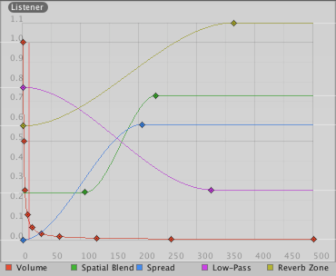
Distance function curves in the AudioSource component in the Inspector.

* The Particle System uses curves to vary particle properties over time.

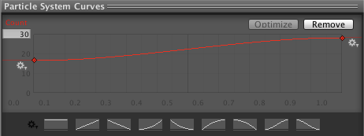

While these controls have subtle differences, the **curves** can be edited in exactly the same way in all of them. This page explains how to navigate and edit curves in those controls.

## Adding and Moving Keys on a Curve

A key can be added to a curve by double-clicking on the curve at the point where the **key** should be placed. It is also possible to add a **key** by right-clicking on a curve and select **Add Key** from the context menu.

Once placed, **keys** can be dragged around with the mouse:

- Click on a **key** to select it. Drag the selected **key** with the mouse.
- To snap the **key** to the grid while dragging it around, hold down **Command** on Mac / **Control** on Windows while dragging.

It is also possible to select multiple **keys** at once:

- To select multiple **keys** at once, hold down **Shift** while clicking the keys.
- To deselect a selected **key**, click on it again while holding down **Ctrl**.
- To select all **keys** within a rectangular area, click on an empty spot and drag to form the rectangle selection.
- The rectangle selection can also be added to existing selected keys by holding down **Shift**.

**Keys** can be deleted by selecting them and pressing **Delete**, or by right-clicking on them and selecting **Delete Key** from the context menu.

## Editing Keys

Direct editing of key values in curve editors is a new feature in Unity 5.1. Use **Enter/Return** or context menu to start editing selected keys, **Tab** to switch between fields, **Enter/Return** to commit, and **Escape** to cancel editing.

## Navigating the Curve View

When working with the **Animation View** you can easily zoom in on details of the curves you want to work with or zoom out to get the full picture.

You can always press **F** to frame-select the shown curves or selected keys in their entirely.

### Zooming

You can **zoom** the Curve View using the scroll-wheel of your mouse, the zoom functionality of your trackpad, or by holding **Alt** while right-dragging with your mouse.

You can zoom on only the horizontal or vertical axis:

- **zoom** while holding down **Command** on Mac / **Control** on Windows to zoom horizontally.
- **zoom** while holding down **Shift** to zoom vertically.

Furthermore, you can drag the end caps of the scrollbars to shrink or expand the area shown in the Curve View.

### Panning

You can **pan** the Curve View by middle-dragging with your mouse or by holding **Alt** while left-dragging with your mouse.

## Editing Tangents

A key has two **tangents** - one on the left for the incoming slope and one on the right for the outgoing slope. The tangents control the shape of the curve between the keys. You can select from a number of different tangent types to control how your curve leaves one key and arrives at the next key. Right-click a key to select the tangent type for that key.

For animated values to change smoothly when passing a key, the left and right tangent must be co-linear. The following tangent types ensure smoothness:

- **Clamped Auto**: This is the default tangent mode. The tangents are automatically set to make the curve pass smoothly through the key. When editing the key’s position or time, the tangent adjusts to prevent the curve from “overshooting” the target value. If you manually adjust the tangents of a key in Clamped Auto mode, it is switched to **Free Smooth** mode. In the example below, the tangent automatically goes into a slope and levels out while the key is being moved:

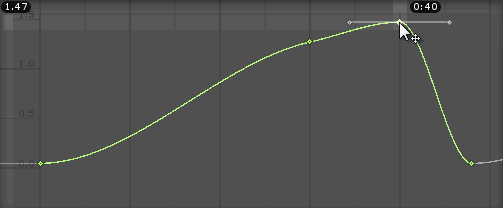

- **Auto**: This is a Legacy tangent mode, and remains an option to be backward compatible with older projects. Unless you have a specific reason to use this mode, use the default **Clamped Auto**. When a key is set to this mode, the tangents are automatically set to make the curve pass smoothly through the key. However, there are two differences compared with **Clamped Auto** mode:
    1. The tangents do not adjust automatically when the key’s position or time is edited; they only adjust when initially setting the key to this mode.
    2. When Unity calculates the tangent, it does not take into account avoiding “overshoot” of the target value of the key.

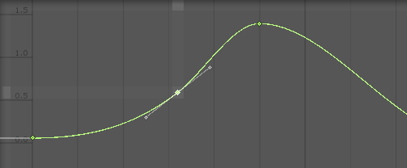

- **Free Smooth**: Drag the tangent handles to freely set the tangents. They are locked to be co-linear to ensure smoothness.

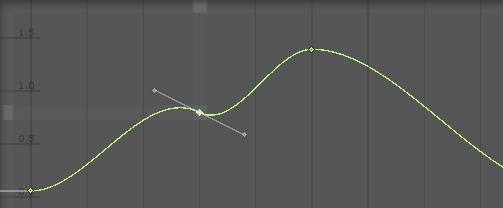

* **Flat**: The tangents are set to be horizontal (this is a special case of Free Smooth).

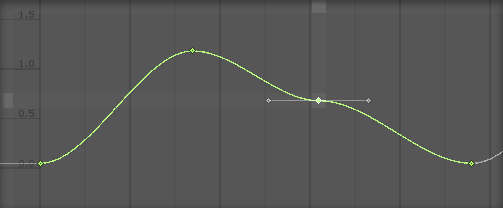

Sometimes you might not want the curve to be smooth when passing through a key. To create sharp changes in the curve, choose one of the **Broken** tangent modes.

When using broken tangents, the left and right tangent can be set individually. Each of the left and right tangents can be set to one of the following types:

- **Broken - Free**: Drag the tangent handle to freely set the tangents.

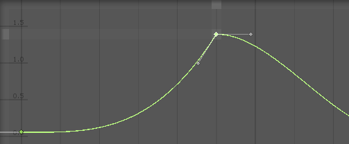

* **Broken** - Linear: The tangent points towards the neighboring key. To make a linear curve segment, set the tangents at both ends to be Linear. In the example below, all three keys have been set to Broken - Linear, to achieve straight lines from key to key.

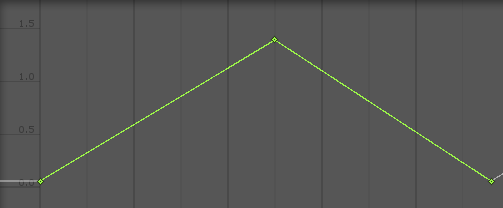

- **Broken - Constant**: The curve retains a constant value between two keys. The value of the left key determines the value of the curve segment.

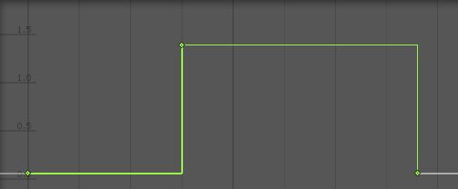