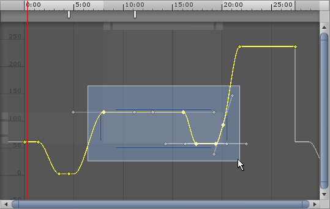
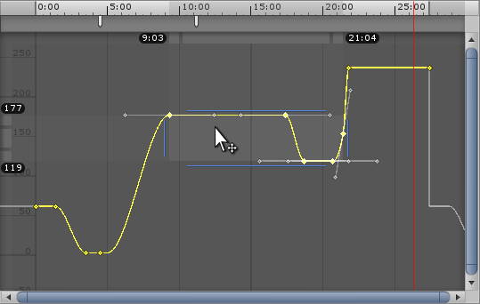

Box Selection is used to select multiple keys while viewing the Animation window in **Curves** mode. This allows you to select and manipulate several keys at once.

The following actions allow you to select multiple keys:

- Hold Shift+click to add individual keys to your selection
- Drag a rectangle with the mouse to select a group of keys
- Hold Shift and drag a rectangle to add or remove group of keys to the current selection

A rectangle dragged across to select multiple keys in **Curves** mode

As you add keys to the selection, Box Selection handles appear on either side of the selected keys, and at the top and bottom. If you add or remove more keys to the selection, the handles automatically adapt their position and size to enclose all the currently selected keys.

Box Selection handles, displayed on all sides of the selected keys

## Moving selected keys

Click anywhere within the Box Selection handles to drag the selected keys and move them. You do not need to click directly on a key to do this; you can drag by clicking the empty space within the Box Selection handles.

While you drag, the time of first and last key is displayed under the timeline bar to help you place your keys at the desired position. While dragging a selection of keys to the left, any keys that end up at a negative time (that is, to the left of the 0 marker on the timeline) are deleted when you release the mouse button.

Dragging a selection of keys. Note the start and end times of the selection displayed under the top timeline bar.

## Scaling selected keys

When you have multiple keys selected, you can **Scale** the selected keys. In Curve mode, you can scale horizontally to change the time placement of the keys, or vertically to change the value of the keys.

### Horizontally scaling selected keys

Use the Box Selection handles to the left and right of the selected keys to scale the selection horizontally. This changes the time placement of the keys without modifying their values. Pull the handles apart to stretch the keys over a longer period of time (making the selected animation slower), or push them closer together to place the keys over a shorter period of time (making the selected animation faster).

While you scale the selection horizontally, the minimum and maximum time of the keys are shown at the top of the view, to help you set your selection to the desired time.

Scaling a selection of keys horizontally. Note the minimum and maximum times of the scaled keys shown at the top of the view.

### Vertically scaling selected keys

Use the Box Selection handles to the top and bottom of the selected keys to scale the selection vertically. This changes the value of the keys without modifying their time placement.

While you scale the selection vertically, the minimum and maximum time of the keys are shown to the left of the view, to help you set your selection to the desired values.

Scaling a selection of keys vertically, modifying their values while preserving their time. Note the new minimum and maximum values of the scaled keys shown to the left if the view.

## Manipulation bars

In addition to the Box Selection handles that appear around your selected keys, there are also grey manipulation bars to the top and left of the **Curves** window, which provide additional ways to manipulate the current selection.

The manipulation bars, highlighted in red

The manipulation bar at the top allows you to modify the time placement of the selected keys, while preserving their values. The bar at the side allows you to modify the values of the keys while preserving their time placement.

When you have multiple keys selected, the bars at the top and right display a square at each end. Drag the centre of the bar to move the selected keys (either horizontally or vertically), or drag the squares at the end of each bar to scale the selected keys.

Just like the Box Selection handles, when moving or scaling the selected keys using grey bars, the minimum and maximum values or **keyframe**  
 times are shown. For the time manipulation bar (at the top of the window), the times of the first and last keyframes are displayed. For the value manipulation bar (at the left of the window), the lowest and highest values of the keys are displayed.

**Note**: the scale boxes at the end of the bars are only visible if you have multiple keys selected, and the view is sufficiently zoomed in so that the bar is long enough to show the scale boxes at each end.

## Ripple editing

Ripple editing is a method of moving and scaling selected keys. This method also affects non-selected keys on the same timeline as the keys that you are manipulating. The name refers to having the rest of your content automatically move along the timeline to accommodate content you have added, expanded or shrunk. The effects of your edit have a “ripple effect” along the whole timeline.

Press and hold the **R** key while dragging inside the Box Selection to perform a **Ripple Move**. This has the effect of “pushing” any unselected keys, plus the original amount of space between your selection and those keys, to the left or right of your selection when you drag the selected keys along the timeline.

Press and hold the **R** key while dragging a Box Selection handle to perform a **Ripple Scale**. The effect on the rest of the unselected keys in the timeline is exactly the same as with a Ripple Move - they are pushed to the left or right as you scale to the left or right side of your Box Selection.