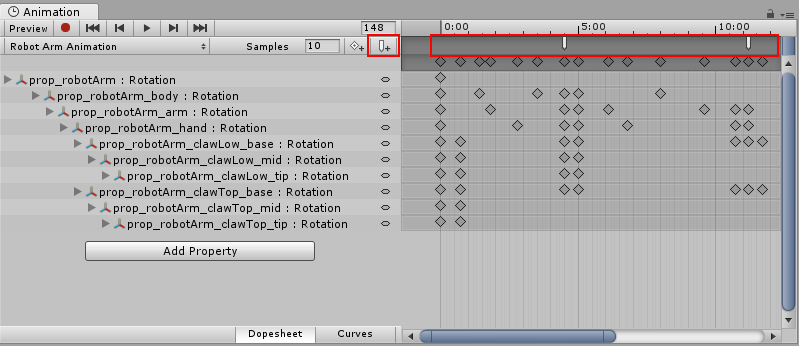
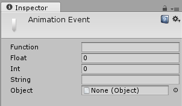
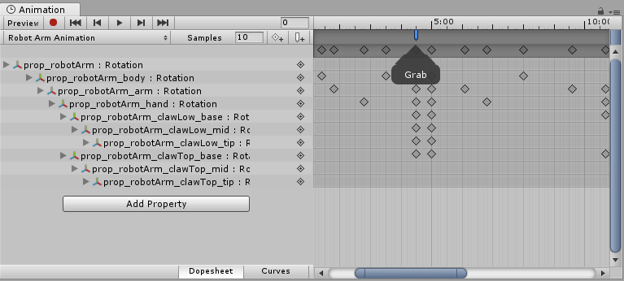
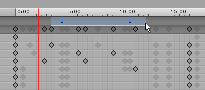
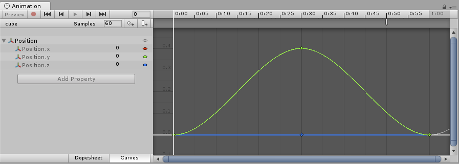

Use Animation Events to call functions at specific points in the timeline. These functions can be in any script attached to the GameObject.

The function called by an Animation Event also has the option to take one parameter. The parameter can be a `float`, `string`, `int`, or `object` reference, or an AnimationEvent object. The AnimationEvent object has member variables that allow a float, string, integer and object reference to be passed into the function all at once, along with other information about the Event that triggered the function call.

```C#

// This C# function can be called by an Animation Event 
public void PrintFloat (float theValue) { 
	Debug.Log ("PrintFloat is called with a value of " + theValue); 
}

```
To add an Animation Event to a clip at the current playhead position, click the **Event** button. To add an Animation event to any point in the Animation, double-click the **Event** line at the point where you want the Event to be triggered. Once added, you can drag the mouse to reposition the Event. To delete an Event, select it and press the **Delete** key, or right-click on it and select **Delete Event**.


**Animation Events** are shown in the **Event Line**. Add a new **Animation Event** by double-clicking the **Event Line** or by using the **Event button**.

When you add an Event, the Inspector Window displays several fields. These fields allow you to specify the name of the function you want to call, and the value of the parameter you want to pass to it.


The **Animation Event** Inspector Window

The Events added to a clip are shown as markers in the Event line. Hold the mouse over a marker to show a tooltip with the function name and parameter value.



You can select and manipulate multiple Events in the timeline.

To select multiple Events in the timeline, hold the **Shift** key and select Event markers one by one to add them to your selection. You can also drag a selection box across them; click and drag within the Event marker area, like this:



## Example

This example demonstrates how to add Animation Events to a simple GameObject. When all the steps are followed, the Cube animates forwards and backwards along the x-axis during Play mode, and the Event message is displayed in the console every 1 second at the 0.8 second time.

The example requires a small script with the function `PrintEvent()`. This function prints a debug message which includes a string (“called at:”) and the time:

```C#
// This C# function can be called by an Animation Event
using UnityEngine;
using System.Collections;


public class ExampleClass : MonoBehaviour
{
    public void PrintEvent(string s)
    {
        Debug.Log("PrintEvent: " + s + " called at: " + Time.time);
    }
}
```

Create a script file with this example code and place it in your Project folder (right-click inside the Project window in Unity and select **Create** > **C# Script**, then copy and paste the above code example into the file and save it).

In Unity, create a Cube GameObject (menu: GameObject > 3D Object > Cube). To add your new script file to it, drag and drop it from the Project window into the Inspector window.

Select the Cube and then open the Animation window (menu: **Window** > **Animation** > **Animation** or use ctrl+6). Set a **Position** curve for the x coordinate.



Next, set the animation for the x coordinate to increase to around 0.4 and then back to zero over 1 second, then create an Animation Event at approximately 0.8 seconds. Press Play to run the animation.