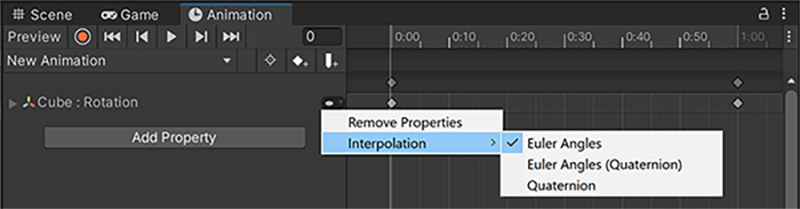

You can use Unity to animate your GameObject’s rotations. There are different methods of applying these rotations to suit your project best.

See [Rotation and orientation in Unity](https://docs.unity.cn/2023.2/Documentation/Manual/QuaternionAndEulerRotationsInUnity.html) for more information on rotational representations.

您可以使用 Unity 为游戏对象的旋转设置动画。有多种方法可以应用这些轮换，以最适合您的项目。

有关旋转表示的更多信息，请参阅 Unity 中的旋转和方向。

## Rotation interpolation

You can use the Animation window to choose how Unity applies rotation to your GameObject. Unity uses interpolation to calculate how a GameObject visually moves from one orientation to another in your animation.

Different interpolation methods look different in motion, but have the same result. Unity offers three types of interpolation for your animations:

```ad-cite



The Animation window, with the interpolation menu expanded to show the rotation interpolation options.

```
您可以使用“动画”窗口来选择 Unity 如何将旋转应用到您的游戏对象。 Unity 使用插值来计算游戏对象如何在动画中从一个方向视觉上移动到另一个方向。

不同的插值方法在运动中看起来不同，但具有相同的结果。 Unity 为您的动画提供三种类型的插值：


#### Euler angle interpolation

**Euler Angles** interpolation applies the full range of motion to the GameObject specified by the angles you enter; if the rotation is greater than 360 degrees, the GameObject rotates fully before it stops at the correct orientation.

**Euler Angles (Quaternion)** interpolation uses the above interpolation method but bakes the information into a **quaternion** curve. This method uses more memory but results in a slightly faster runtime.

欧拉角插值将整个运动范围应用于您输入的角度指定的游戏对象；如果旋转大于 360 度，游戏对象会完全旋转，然后停止在正确的方向。

欧拉角（四元数）插值使用上述插值方法，但将信息烘焙成四元数曲线。此方法使用更多内存，但运行时间稍快。


#### Quaternion interpolation

**Quaternion** interpolation rotates the GameObject across the shortest distance to a particular orientation. For example, regardless of whether the rotation value is 5 degrees or 365 degrees, the GameObject rotates 5 degrees.

四元数插值将游戏对象旋转到特定方向的最短距离。例如，无论旋转值为5度还是365度，GameObject都会旋转5度。

```ad-note

三种旋转插值。
* 欧拉角插值，可以转超过一圈。
* 欧拉角插值，烘焙成四元数，可以转超过一圈，空间换时间。
* 四元数插值，只支持最短路径。

```

---

## External animation sources

Animation from external sources often contains rotational keyframe animation in Euler format. Unity resamples these animations and generates new keyframes for each frame in the animation to avoid rotations that exceed the valid range of rotational quaternions.

For example, if you have two keyframes that are six frames apart with the x value going from 0 to 270 degrees, the GameObject rotates 90 degrees in the opposite direction because it’s the shortest way to get to the same result. Instead, Unity resamples and adds a keyframe on every frame, so the rotation is only 45 degrees between keyframes and the rotation is correct.

来自外部源的动画通常包含欧拉格式的旋转关键帧动画。 Unity 对这些动画重新采样，并为动画中的每个帧生成新的关键帧，以避免旋转超出旋转四元数的有效范围。

例如，如果您有两个相距 6 帧的关键帧，且 x 值从 0 到 270 度，则游戏对象会向相反方向旋转 90 度，因为这是获得相同结果的最短方法。相反，Unity 会在每一帧上重新采样并添加一个关键帧，因此关键帧之间的旋转仅为 45 度，并且旋转是正确的。

```ad-note

外源动画一般用欧拉角，unity会重新采样生成关键帧，以避免烘焙成四元数的过程 旋转超过四元数的有效范围。

```


#### Resolve rotation problems with external animation sources

If the quaternion resampling of the imported animation doesn’t match the original closely enough for your needs, you can turn off animation resampling and use the original Euler animation keyframes at runtime. For more information, see Euler curve resampling.

如果导入动画的四元数重采样不能满足您的需求，您可以关闭动画重采样，并在运行时使用原始的欧拉动画关键帧。有关更多信息，请参见欧拉曲线重采样。

