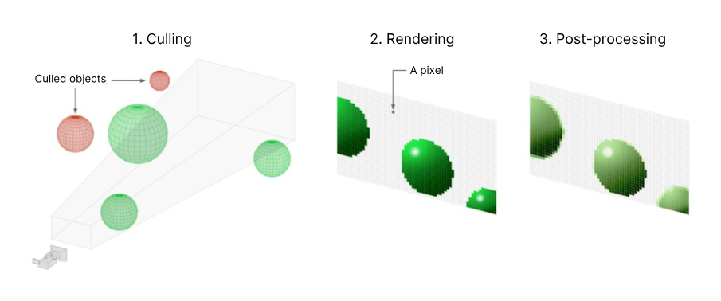

---
tags:
  - Unity
  - Graphics
url: https://docs.unity.cn/Manual/render-pipelines-overview.html
---

渲染管道执行一系列操作，获取场景的内容并将其显示在屏幕上。

在 Unity 中，您可以在不同的渲染管道之间进行选择。 Unity 提供了三个具有不同功能和性能特征的预构建渲染管道，您也可以创建自己的渲染管道。

## 渲染管线的工作原理

渲染管道遵循以下步骤：

1. 剔除 Culling，管道决定显示场景中的哪些对象。
   这通常意味着它会删除相机视图之外的对象（视锥体剔除）或隐藏在其他对象后面的对象（遮挡剔除）。
   
2. 渲染，管道将具有正确光照的对象绘制到像素缓冲区中。
   
3. 后处理，管道修改像素缓冲区以生成显示的最终输出帧。
   修改的示例包括颜色分级、光晕和景深。

## Unity 中的渲染管线

在 Unity 中，您可以为您的项目使用以下预构建渲染管道之一。

内置渲染管道是 Unity 的默认渲染管道。它是一个通用渲染管道，定制选项有限。

通用渲染管道 (URP) 是您可以自定义的可编写脚本的渲染管道。它允许您在各种平台上创建可扩展的图形。

高清渲染管道 (HDRP) 是一种可编写脚本的渲染管道，可让您在高端平台上创建尖端的高保真图形。

脚本化渲染管道让您可以直接在 C# 中检查和更改剔除、渲染和后处理的工作方式。当您购买 Unity 引擎 C++ 源代码的访问权限时，也可以在内置渲染管道中进行这种级别的自定义。

如果您是一位经验丰富的图形开发人员，具有高级自定义需求，您还可以使用 Unity 的可编写脚本的渲染管道 API 创建自己的自定义渲染管道。
