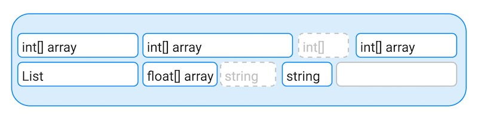

# Managed memory introduction

Unity’s managed memory system is part of the C# scripting environment provided by either the Mono or IL2CPP Virtual Machines (VM). The benefit of the managed memory system is that it manages the release of memory, so you don’t need to manually request the release of memory through your code. These VM offer a controlled memory environment consisting of the following parts:

* **The managed heap**: A section of memory that the VM automatically controls with a garbage collector. The memory allocated on the managed heap is referred to as GC Allocation, and the Profiler records any occurrence of such an allocation as a GC.Alloc sample.
* **The scripting stack**: This is a fixed-size memory region allocated at the start of each thread. It tracks temporary data like variables and execution flow as your application moves in and out of code blocks.
* **Native VM memory**: Contains memory related to the execution and management of Unity’s scripting VM. You don’t have direct access to it and the normal execution of your code influences it indirectly. It’s useful to know that it includes memory related to the executable code that your code generates, in particular memory used for generics, type meta data used for reflection, and the memory required to run the VM.

Unity 的托管内存系统是 Mono 或 IL2CPP 虚拟机 (VM) 提供的 C# 脚本环境的一部分。托管内存系统的好处是它管理内存的释放，因此您不需要通过代码手动请求释放内存。这些虚拟机提供受控内存环境，由以下部分组成：

* 托管堆：VM 使用垃圾收集器自动控制的内存部分。在托管堆上分配的内存称为 GC 分配，Profiler 会将任何此类分配的发生记录为 GC.Alloc 样本。
* 脚本堆栈：这是在每个线程开始时分配的固定大小的内存区域。当您的应用程序移入和移出代码块时，它会跟踪变量和执行流等临时数据。
* 本机VM内存：包含与Unity脚本VM的执行和管理相关的内存。您无法直接访问它，代码的正常执行会间接影响它。知道它包括与代码生成的可执行代码相关的内存是很有用的，特别是用于泛型的内存、用于反射的类型元数据以及运行虚拟机所需的内存。


---

## Automatic memory management

Unity’s managed memory system uses a garbage collector and a managed heap to automatically free memory allocations when your scripts no longer hold any references to those allocations. This helps protect against memory leaks, which happen when allocated memory is never freed because the reference required to free it manually has been lost.

Unity’s memory management system guards memory access, which means that you can’t access memory that has been freed, or that was never valid for your code to access. However, this memory management process impacts runtime performance, because allocating managed memory is time-consuming for the CPU. Garbage collection might also stop the CPU from doing other work until it completes.

In the following diagram, the blue box represents a quantity of memory that Unity allocates to the managed heap. The white boxes within it represent data values that Unity stores within the managed heap’s memory space. When additional data values are needed, Unity allocates them the free space from the managed heap (annotated A).

```ad-note


A quantity of memory. Marked A on the diagram is some free memory.

```


### Types allocated to the heap

When a method is called, the scripting back end copies the values of its parameters to an area of memory reserved for that specific call, in a data structure called a call stack. The scripting back end can quickly copy data types that occupy a few bytes. However, it’s common for objects, strings, and arrays to be much larger, and it’s inefficient for the scripting back end to copy these types of data on a regular basis.

### Memory fragmentation and heap expansion

When Unity releases an object, the memory that the object occupied is freed up. However, the free space doesn’t become part of a single large pool of free memory.

The objects on either side of the released object might still be in use. Because of this, the freed space is a gap between other segments of memory. Unity can only use this gap to store data of identical or lesser size than the released object. This situation is called memory fragmentation, and the following diagram shows an example of this:

```ad-note



A quantity of memory, with some objects released represented by grey dashed lines.

```

Memory fragmentation happens when there’s a large amount of memory available in the heap, but it’s only available in the memory gaps between objects. Even though there’s enough total space for a large memory allocation, the managed heap can’t find a large enough single block of contiguous memory to assign to the allocation.

If a large object is allocated and there’s insufficient contiguous free space to accommodate it, the Unity memory manager performs two operations:

1. The garbage collector runs, if it hasn’t already done so. This attempts to free up enough space to fulfill the allocation request.
2. If, after the garbage collector runs, there’s still not enough contiguous space to fit the requested amount of memory, the heap must expand. The specific amount that the heap expands is platform-dependent. On most platforms, when the heap expands, it expands by double the amount of the previous expansion. If the requested allocation size is bigger than that, Unity performs an out-of-cycle expansion to fit that allocation and continue from the previous regular expansion size as a basis for the next expansion.

Unity doesn’t release the memory allocated to the managed heap when it expands regularly. Instead, it retains the expanded heap, even if a large section of the heap is empty. This prevents the need to re-expand the heap if further large allocations occur.

On most platforms, Unity eventually releases the memory that the empty portions of the managed heap uses back to the operating system. The interval at which this happens isn’t guaranteed and is unreliable. This requires these portions to consist of one or more full memory pages (4 KB on most platforms).


---


## Managed heap and native memory


The garbage collector doesn’t clear out native memory objects or other native allocations. Unity only clears native memory in the following situations:

* When Resources.UnloadUnusedAssets is called. You can manually call UnloadUnusedAssets, or Unity calls it automatically when unloading a scene due to a loading a new scene in LoadSceneMode.Single. For asynchronous scene unloads you can request assets that were dynamically created and embedded in the scene at build-time with the parameters of SceneManager.UnloadSceneAsync and the option UnloadSceneOptions.UnloadAllEmbeddedSceneObjects. Calling SceneManager.UnloadSceneAsync with UnloadSceneOptions.UnloadAllEmbeddedSceneObjects doesn’t unload regular assets that Unity loaded to use in the scene, or dynamically and run-time created assets.
* When Destroy is called on an object.

Resources.UnloadUnusedAssets unloads all native objects that no longer have any references pointing to them. If you want to free the memory earlier, for example if you have full screen RenderTexture instances on platforms with low RAM, call Destroy on the objects.

If you want to have more control over the assets that stay in memory, use AssetBundles and Addressables.

Important: Calling UnloadUnusedAssets or GC.Collect is a CPU-intensive process. In large projects it might take several seconds to complete

Before calling UnloadUnusedAssets, make sure you’re not holding managed references to the native objects you want to be cleaned up, or the native objects won’t be unloaded. Static fields and events are common ways to hold on to these objects without meaning to. For more information on how to analyze these issues with the Memory Profiler, refer to Managed shell objects in the Memory Profiler package documentation.