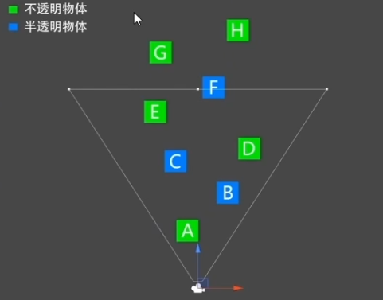
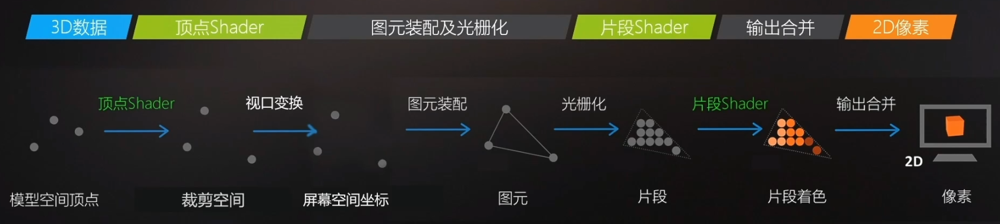
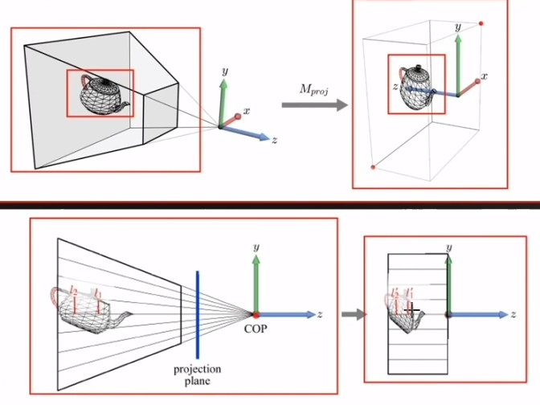
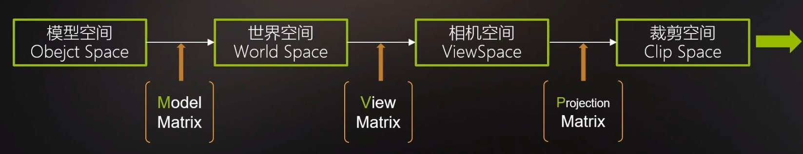
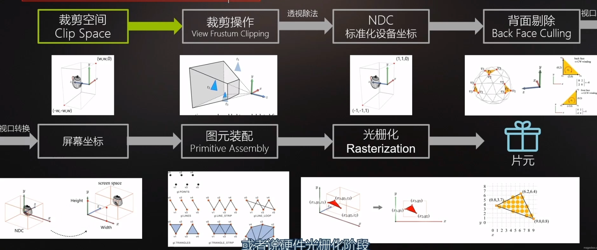
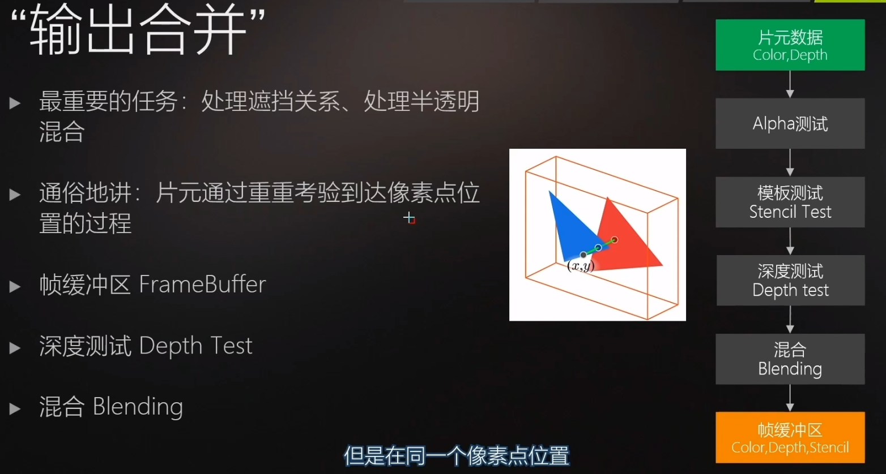
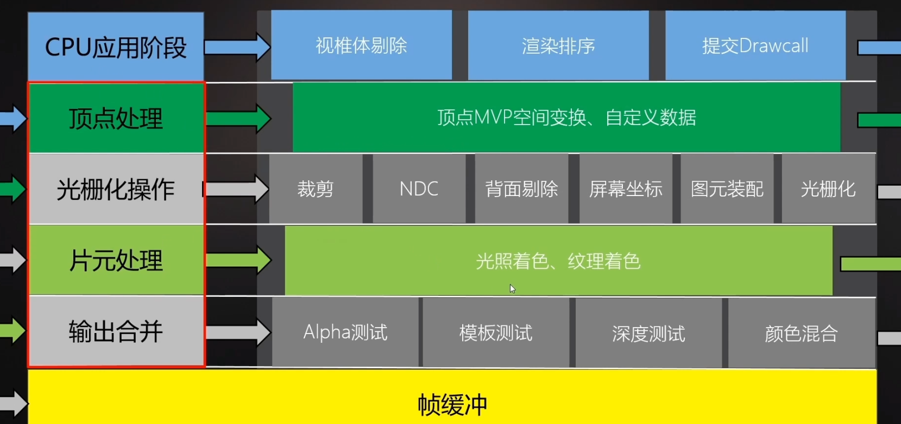

#### 摄像机

Clear Flags，清屏操作

Depth，影响摄像机的先后顺序，越小越先渲染


---

# 应用阶段

## 1. Culling 剔除
剔除不会被渲染的物体。

#### 视椎体剔除

根据相机，近裁面，远裁面。
用视椎体和场景物体 做碰撞检测，没碰撞的就剔除。

用物体AABB包围盒 优化碰撞检测。

#### 层级剔除

相机的Culling Mask，可以剔除特定Layer的物体。

#### 遮挡剔除


## 2. Sort 排序
对要渲染的物体，渲染顺序排序。

#### 渲染队列 Render Queue
材质上的RenderQueue越小，越先渲染。

不透明渲染队列，RenderQueue<2500，按摄像机距离 **从前到后** 排序（存在遮挡 不用渲染被遮住的部分）

透明渲染队列，RenderQueue>2500，按摄像机距离 **从后到前** 排序。

```ad-faq


下图中的渲染顺序。

先不透明，从前往后，ADE；
再透明，从后往前，FCB。

```


## 3. Batch 打包数据

模型信息：
顶点坐标、法线、UV、切线、顶点色、索引列表。

变换矩阵：
世界变换矩阵、VP矩阵（根据 相机位置 和 fov参数）

灯光材质参数：
Shader、材质参数、灯光信息。

```ad-quote

导出的OBJ模型信息

~~~
# Blender 4.5.3 LTS
# www.blender.org
o Cube

# 顶点八个
v 1.000000 2.000141 -1.000000
v 1.000000 0.000141 -1.000000
v 1.000000 2.000141 1.000000
v 1.000000 0.000141 1.000000
v -1.000000 2.000141 -1.000000
v -1.000000 0.000141 -1.000000
v -1.000000 2.000141 1.000000
v -1.000000 0.000141 1.000000

# 顶点法线 6个不同的
vn -0.0000 1.0000 -0.0000
vn -0.0000 -0.0000 1.0000
vn -1.0000 -0.0000 -0.0000
vn -0.0000 -1.0000 -0.0000
vn 1.0000 -0.0000 -0.0000
vn -0.0000 -0.0000 -1.0000

# 顶点纹理坐标
vt 0.875000 0.500000
vt 0.625000 0.750000
vt 0.625000 0.500000
vt 0.375000 1.000000
vt 0.375000 0.750000
vt 0.625000 0.000000
vt 0.375000 0.250000
vt 0.375000 0.000000
vt 0.375000 0.500000
vt 0.125000 0.750000
vt 0.125000 0.500000
vt 0.625000 0.250000
vt 0.875000 0.750000
vt 0.625000 1.000000

# 索引列表
s 0
f 5/1/1 3/2/1 1/3/1
f 3/2/2 8/4/2 4/5/2
f 7/6/3 6/7/3 8/8/3
f 2/9/4 8/10/4 6/11/4
f 1/3/5 4/5/5 2/9/5
f 5/12/6 2/9/6 6/7/6
f 5/1/1 7/13/1 3/2/1
f 3/2/2 7/14/2 8/4/2
f 7/6/3 5/12/3 6/7/3
f 2/9/4 4/5/4 8/10/4
f 1/3/5 3/2/5 4/5/5
f 5/12/6 1/3/6 2/9/6

~~~

```

## 4. 调用 SetPassCall、DrawCall


---


# GPU渲染管线



## 1. 顶点Shader
处理每个顶点数据，将顶点的模型空间坐标，变换到 裁剪空间坐标。



将视椎体坐标系，变换为 2x2x1的立方体CVV（裁剪空间坐标系）





## 2. 图元装配及光栅化



#### 视口变换
顶点的裁剪空间坐标，变换到 屏幕空间坐标

#### 图元装配
将定点装配成 图元

#### 光栅化
将图元插值，生成一个个片元

## 3. 片段着色器
对片元着色，纹理技术、光照计算。

#### 纹理技术

**纹理采样算法**

**纹理过滤机制**
Filter Mode，处理 小纹理到大区域 和 大纹理到小区域 问题。

**MipMap**
纹理链技术，参考unity 生成Mipmaps选项。

**纹理寻址模式**
参考unity Wrap Mode

**纹理压缩格式**
要转为对应平台支持的纹理压缩格式，参考效果。

#### 光照技术

**光照组成**
直接光照+间接光照

**光照模型**


## 4. 输出合并
处理片段间，遮挡混合等，输出到帧缓冲区




---

