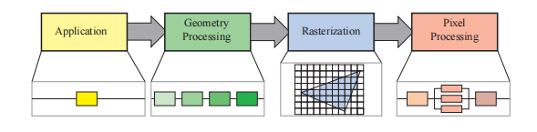
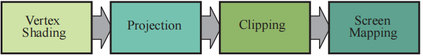

本章节介绍了实时图形学中的核心组件，它被称为“图形渲染管线（graphics rendering pipeline）”，也被简称为“管线”。渲染管线的核心功能就是利用给定的虚拟相机、三维物体、光源等信息，来生成或者渲染（render）一张二维图像。因此，渲染管线是实时渲染中的底层工具，其功能如图2.1所示。最终图像中物体的位置和形状，由其几何结构，环境特征以及相机位置所决定。而物体的外观则会受到材质属性、光源、纹理（应用在物体表面上的图像）以及着色方程的影响。

我们将会介绍渲染管线中的各个阶段，在本章节中，我们将会重点关注各个阶段的功能而不是实现方式，有关如何应用这些阶段的内容，将在后续章节中进行详细介绍。

## 2.1 渲染管线的架构

在现实世界中，流水线（pipeline）的概念有很多种表现形式，从工厂的装配线到快餐厨房等，它也同样适用于图形渲染领域。一个流水线中会包含若干个阶段，每个阶段负责完成总任务中的一部分任务

流水线阶段可以并行执行，其中每个阶段都依赖于前一个阶段的结果。在理想状态下，一个非流水线化的系统可以被划分为n个流水线阶段，从而提升n倍的速度，这种性能上的提升是使用流水线的主要原因。举个例子，一组员工就可以快速制作一大批的三明治：一个人负责准备面包，一个人负责添加肉片，另一个人负责添加其他配料。每个人都会将结果传递给流水线上的下一个人，同时立即开始下一个三明治的制作。如果每个人都需要20秒的时间来完成各自的任务，那么每20秒就可以生产一个三明治，一分钟就可以生产3个。虽然流水线阶段可以并行进行，但是整个流水线的效率会被执行速度最慢的那个阶段所影响。比如说：如果给三明治加肉片的阶段变得比之前更复杂了，现在需要30秒时间才能完成，那么现在流水线的最快速度就是一分钟生产两个三明治了。对于这个三明治流水线而言，加肉阶段就是整个流水线的瓶颈，因为它决定了整个生产过程的最终速度。在等待加肉阶段完成之前，加料阶段是“饥饿（starved）”的（用户也是）。


```ad-quote
图2.2：渲染管线的基本结构，包含以下四个阶段：应用阶段、几何处理阶段、光栅化阶段和像素处理阶段。每个阶段本身也可以是一个流水线，例如几何处理阶段下方的图示（包含4个子阶段）；有些阶段也可以（部分）并行化执行，例如像素处理阶段下方的图示（三个子阶段并行执行）。在上图中，应用阶段是一个单独的处理过程，但是这个阶段同样也可以流水线化或者并行化。另外请注意，光栅化会查找一个图元内部的像素，例如一个三角形内部的像素。
```


在实时渲染领域中也可以找到这样的流水线结构，一种粗略的划分方法是将渲染管线分为四个阶段——应用阶段（application）、几何处理阶段（geometry processing）、光栅化阶段（rasterization）和像素处理阶段（pixel processing），如图2.2所示。这个结构（渲染管线的引擎）是实时计算机图形程序的核心，也是后续章节的基础概念。每个阶段本身通常也是一个流水线，这意味着每个阶段也是由几个子阶段构成的。在这里我们将功能性阶段（functional stage）（如上图所示）和其实现结构的概念（the structure of implementation）区分开来。一个功能性阶段有一个特定的任务需要执行，但是并没有指定它在管线中的实现方式。一个给定的实现方式也可能会将两个功能性阶段合并成一个功能单元，或者使用可编程核心来执行；同时它也可以将一个很耗时的功能性阶段，划分为几个硬件单元来完成。

渲染速度可以用每秒帧数（FPS）来进行表示，即每秒显示的帧数；也可以用赫兹（Hz）来进行表示，这个单位代表了1/seconds，即更新的频率。通常我们也会直接使用渲染一张图像所花费的时间（毫秒）来表示渲染速度，生成每帧图像所花费的时间往往并不相同，这取决于每帧中所执行计算的复杂度大小。FPS可以用来表示某一帧的速率，也可以表示一段时间内的平均性能。Hz一般被设定成一个固定的值，多用于硬件设备中，例如显示器等。（FPS：帧数，Hz：硬件刷新率）。

顾名思义，应用阶段（application）是由应用程序进行驱动的，它在软件中进行实现，运行在通用CPU上。这些CPU一般都具有多个核心，可以并行处理多个线程（thread）的任务，这使得CPU可以高效执行由应用阶段所负责的各种任务，一般CPU会负责碰撞检测，全局加速算法，动画，物理模拟等任务，具体会执行哪些任务取决于应用程序的类型。

下一个主要阶段是几何处理阶段（geometry processing），它负责处理变换（transform），投影（projection）以及其他所有和几何处理相关的任务。这个阶段需要计算哪些物体会被绘制，应该如何进行绘制，以及应当在哪里绘制等问题。几何阶段通常运行在图形处理单元（GPU）上，它包含一系列的可编程单元和固定操作硬件。

光栅化阶段（rasterization）通常会将构成一个三角形的三个顶点作为输入，找到所有位于三角形内部的像素，并将其转发到下一个阶段中。

最后一个阶段是像素处理阶段（pixel processing），对于每个像素而言，都会执行一个程序来决定它的颜色；并执行深度测试，来判断这个像素是否可见；这里还可以执行一些逐像素的操作，例如将新计算的颜色和之前的颜色进行混合。光栅化阶段和像素处理阶段同样完全运行在GPU上。所有这些阶段及其内部的子流水线阶段，将会在接下来的四个小节中进行讨论。

---

## 2.2 应用阶段

由于应用阶段通常都运行在CPU上， 因此开发者可以完全控制在应用阶段发生的事情，开发者可以决定应用程序的具体实现方式，也可以在之后对其进行修改优化，从而提高程序的性能表现。对应用阶段的修改也会影响后续阶段的性能表现。例如：一个应用阶段中的算法或者设置，可以减少后续需要进行渲染的三角形数量。

尽管如此，有一些应用阶段中的任务也可以让GPU来进行执行，即通过使用一个叫做计算着色器（compute shader）的独立模式，该模式会将GPU视为一个高度并行的通用处理器，而忽略其专门用于图形渲染的特殊功能。

在应用阶段的最后，需要进行渲染的几何物体会被输入到几何处理阶段中，这些几何物体被称作为渲染图元（rendering primitive），即点、线和三角形。这些图元最终可能会出现在屏幕上（或者是任何正在使用的显示设备上），这也是应用阶段中最重要的任务。

由于这一阶段**基于软件实现**（software-based），其中一个结果就是，它并没有像之后的几何处理、光栅化和像素处理等阶段一样，被进一步划分出子阶段。

由于CPU自身就是一个规模很小的流水线，因此我们也可以说，应用阶段也被进一步划分为了几个子阶段，但是这与本章节的主题关系不大。

但是为了提升效率，应用阶段通常也会利用多个处理器核心来并行化执行，在CPU设计中，这被称为多核（multi-core）构造，因为它可以在同一阶段执行多个进程。在章节18.5中我们介绍了一些多核心调度的方法。

碰撞检测（collision detection）通常会在这个阶段中实现。当检测到两个物体之间的碰撞之后，会产生相应的响应，并返回给碰撞物体，同时也返回给力反馈设备（如果有的话）。应用阶段同样也是处理其他来源输入的地方，例如键盘、鼠标或者头戴式显示器等，会根据不同的输入，从而采取不同的操作。此外，一些加速算法例如特殊的剔除算法（第19章）等，以及渲染管线剩余部分无法处理的一切问题，都会在应用阶段中完成。


## 2.3 几何处理阶段

运行在GPU上的几何处理阶段会负责大部分的逐三角形（per-triangle）和逐顶点（per-vertex）操作。将几何处理阶段再细分下去，可以划分为以下几个功能性阶段：顶点着色（vertex shading）、投影（projection）、裁剪（clipping）和屏幕映射（screen mapping），如图2.3所示.



### 2.3.1 顶点着色

顶点着色（vertex shading）的任务主要有两个，一个是计算顶点的位置，另一个是计算那些开发人员想要作为顶点数据进行输出的任何参数，例如法线（normal）和纹理坐标（texture coordinate）等。在早些时候，物体的光照是逐顶点计算的，通过将光源应用于每个顶点的位置和法线，从而计算并存储最终的顶点颜色；然后再通过对顶点颜色进行插值，来获取三角形内部像素的颜色，因此这个可编程的顶点处理单元被命名为顶点着色器（vertex shader）[1049]。随着现代GPU的出现，以及几乎全部的着色计算都在逐像素的阶段进行，因此顶点着色阶段变得越来越通用，甚至可能并不会在该阶段中进行任何的着色计算，当然这也取决于开发人员的意图，我们仍然可以在顶点着色器中进行着色计算。顶点着色器如今是一个更加通用的单元，它负责计算并设置与每个顶点都相关的数据。例如在章节4.4和章节4.5中，顶点着色器可以用来计算物体的动画。

首先我们描述一下顶点位置是如何被计算出来的，它需要一组顶点坐标来作为输入。在物体最终进入屏幕的过程中，它需要在不同的空间（space）或者坐标系（coordinate system）下，进行若干次变换。最开始时，模型位于自身的模型空间（model space）中，也可以简单地认为它没有进行任何变换。每个模型都可以与一个模型变换（model transform）相关联，以便调整自身的位置和朝向。我们可以将若干个模型变换和同一个模型相关联，这样我们就能够在不复制这个模型的前提下，在一个场景中放置同一个模型的多个副本（也叫做实例，instance），每个实例都拥有各自不同的位置和朝向（即模型变换）。

模型变换会对模型的顶点和法线进行变换，模型本身所处的坐标系叫做模型坐标系（model coordinates），它的坐标也被称为模型坐标。当对这些坐标进行模型变换之后，这个模型便位于世界坐标系（world coordinate）或者叫做世界空间（world space）中。世界空间是唯一的，当各个模型经过各自的模型变换之后，所有的模型便都位于一个相同的空间中。

如前文所述，只有被相机（或者观察者）看到的模型才会被渲染，相机在世界空间中有一个位置参数和方向参数，用于放置相机和调整相机的朝向。为了便于后续的投影操作和裁剪操作，相机和世界空间中的所有模型，都会应用观察变换（view transform），观察变换的主要目的是将相机放置在原点上，并调整相机的朝向，使其看向z轴负半轴的方向，同时y轴指向上方，x轴指向右方。本文中我们将会使用指向负z轴的约定，有一些书籍则更喜欢让相机看向正z轴的方向，二者之间的区别主要是语义上的，因为二者之间的转换十分简单。在应用观察变换之后，模型的具体位置和具体方向取决于底层图形API的实现方式。这样形成的空间被称作相机空间（camera space），或者是更加常见的观察空间（view space）和眼睛空间（eye space）。图2.4是观察变换的一个例子，它展示了观察变换是如何对相机和模型产生影响的。模型变换和观察变换都是使用4×4矩阵实现的，我们将在第4章讨论这个话题。这里我们需要认识到，顶点的坐标和法线，都可以按照程序员所喜欢的任何方式来进行计算。