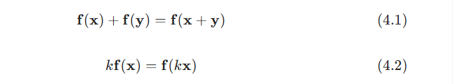

# Chapter 4 Transform 变换

变换（transform）是指以点、向量、颜色等实体作为输入，并以某种方式对其进行转换的一种操作。对于计算机图形学从业者而言，熟练掌握变换相关的知识是非常重要的。通过各种变换操作，我们可以对物体、光源和相机进行移动、变形以及设定动画；我们还可以确保所有的计算都在同一个坐标系下进行，以及使用不同的方式来将物体投影到一个平面上。这里我们只列举了变换所能完成的部分操作，但是足以证明变换在实时图形学中的重要性，或者可以说，在任何领域图形学中的重要性。

线性变换（linear transform）是指一种仅保留向量加法和标量乘法的变换，具体来说就是：

例如：现在有一个变换 $\mathbf{f(x)} = 5\mathbf{x}$ ，它代表将输入向量 $\mathbf{x}$ 的每个分量都乘以5。为了证明这个变换是线性的，它必须满足上述两个条件（即方程4.1和方程4.2）：第一个条件是成立的，因为任意两个向量先乘以5再相加，等同于两个向量相加再乘以5；第二个标量乘法的条件也是显然成立的（方程4.2）。这个函数叫做一个缩放变换（scaling transform），因为它改变了一个物体的大小（尺寸）。旋转变换（rotation transform）是另一种线性变换，它将一个向量以原点为中心进行旋转。缩放变换以及旋转变换，以及事实上所有应用于三维向量的线性变换，都可以使用一个 $3 \times 3$ 矩阵来进行表示。

但是，3×3的矩阵尺寸通常是不够的。函数 f(x)=x+(7,3,2) 是一个非线性变换，其中的向量x是一个三维向量。对两个不同的向量分别执行这个函数，其结果为每个向量各自加上(7,3,2)。让一个向量加上另一个固定的向量，意味着完成了一次平移变换（translation），即它以相同的程度对所有输入向量进行了移动，这是一种非常有用的变换类型。我们还可以将各种各样的变换组合在一起，例如：我们可以先将一个物体缩放为原来的一半，然后再将其移动到一个不同的位置上。到目前为止，我们使用这些变换的方式还很简单，而且我们很难以这种方式（3×3矩阵）来将各种变换组合在一起。

我们可以使用仿射变换（affine transform）的形式来将线性变换和平移变换组合在一起，仿射变换通常存储在一个4 \times 4的矩阵中。仿射变换是指先进行一次线性变换，然后再进行一次平移操作的变换。我们使用齐次符号（homogeneous notation）来表示这样的四维向量，点和方向也会使用同样的方式来进行表示（小写的粗体字母），二者之间的区别是：代表方向的向量，其w分量为0；代表点的向量，其w分量为1。例如：方向向量可以表示为 $\mathbf{v} = \begin{array}{} (v_x & v_y & v_z & 0)^T \end{array}$，点可以表示为 $\mathbf{v} = \begin{array}{} (v_x & v_y & v_z & 1)^T \end{array}$ 。在本章节中，我们将大量使用线性代数中的术语和操作，你可以在realtimerendering.com中找到有关线性代数的附录。

实时渲染中所使用的平移、旋转、缩放、对称和剪切矩阵都是仿射类型的。仿射变换最主要的特征就是它保证了直线的平行性（即两个平行的直线在变换之后仍然是平行的），但是其长度和角度可能会发生一些变化。一个仿射变换也可以表示为一系列独立仿射变换的组合。

本章将从最基本的仿射变换开始说起，章节4.1可以看成是这些简单变换的“参考手册”，我们会在接下来的章节中描述更加复杂的矩阵；然后会对四元数（quaternion）进行讨论和介绍，四元数是一个非常强大的变换工具；再接下来，我们会讨论有关顶点混合和变形的内容，这是两种用于描述网格动画的方式，它们简单且有效；最后我们会介绍投影变换矩阵。表4.1总结了本章节中所涉及大部分变换的符号、函数和属性；这里还需要说明一点的是，正交矩阵的逆矩阵（inverse）就是它的转置矩阵（tanspose）。

| 符号                                                                        | 名称     | 特征描述                                                                  |
| ------------------------------------------------------------------------- | ------ | --------------------------------------------------------------------- |
| $\mathbf{T(t)}$                                                           | 平移矩阵   | 移动一个点；仿射变换                                                            |
| $Rx(ρ)\mathbf{R}_x(\rho)Rx​(ρ)$                                           | 旋转矩阵   | 绕xxx轴旋转ρ\rhoρ弧度；绕$y,z $轴旋转的标记也是类似的；正交矩阵 & 仿射变换                        |
| R\mathbf{R}R                                                              | 旋转矩阵   | 任意的旋转矩阵；正交矩阵 & 仿射变换                                                   |
| S(s)\mathbf{S(s)}S(s)                                                     | 缩放矩阵   | 根据传入的向量s\mathbf{s}s，沿x,y,zx,y,zx,y,z方向进行缩放；仿射变换                       |
| Hij(s)\mathbf{H}_{ij}(s)Hij​(s)                                           | 剪切变换   | 将分量iii相对于分量jjj进行剪切，其中$i,j∈{x,y,z}i,j \in \{ x,y,z \}i,j∈{x,y,z}$；仿射变换 |
| E(h,p,r)\mathbf{E}(h,p,r)E(h,p,r)                                         | 欧拉变换   | 根据给定的欧拉角（yaw，pitch，roll）调整矩阵的朝向；正交矩阵 & 仿射变换                           |
| Po(s)\mathbf{P}_o(s)Po​(s)                                                | 正交投影矩阵 | 平行投影到一个平面或者是体积上；仿射变换                                                  |
| Pp(s)\mathbf{P}_p(s)Pp​(s)                                                | 透视投影矩阵 | 透视投影到一个平面或者体积上                                                        |
| slerp(q^,r^,t)\mathsf{slerp}(\mathbf{\hat{q}, \hat{r}}, t)slerp(q^​,r^,t) | 球面插值   | 根据参数ttt，在四元数q^,r^\mathbf{\hat{q}, \hat{r}}q^​,r^中创建一个插值四元数            |
表4.1：对本章中所讨论的大部分变换的总结。

这些变换是操控几何物体的基本工具，大部分图形应用程序的接口都允许开发者对这些矩阵进行自定义。有时候还有一些库会对本章节中所讨论的矩阵操作进行封装，以便开发者进行调用；但是，深入理解这些函数调用背后的矩阵操作和变换细节是非常有价值的。了解矩阵在各种函数调用之后做了些什么仅仅是一个开始，深入理解这些矩阵本身的属性，可以帮助我们在图形学上走得更远。例如：当我们在处理一个正交矩阵的时候，这些对矩阵的知识让我们知道，正交矩阵的逆矩阵实际上就是它的转置矩阵，我们可以通过获取其转置矩阵的方式，来快速求解正交矩阵的逆矩阵。类似这样的知识可以帮助我们写出速度更快的代码。

---

## 4.1 基本变换

本小节会介绍最基本的变换操作，例如平移、旋转、缩放、剪切、变换组合、刚体变换、法线变换以及计算逆矩阵等。对于有经验的读者而言，本小节可以看作是这些简单变换的参考手册；而对于初学者而言，本小节可以作为对矩阵变换的介绍与入门。对于本章剩余部分以及本书其他章节而言，本小节的内容是必要的背景和前置知识。这里我们将从最简单的平移变换开始讲起。

### 4.1.1 平移

