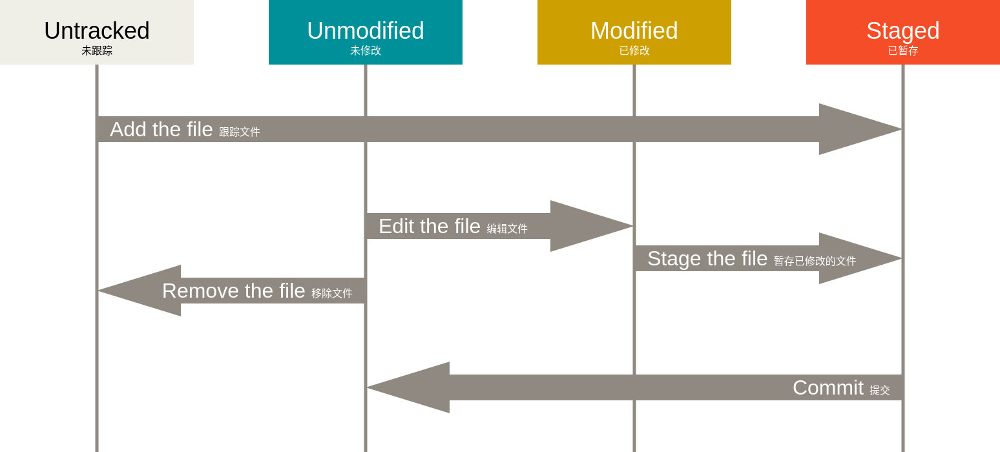

---
tags:
  - git
---
---
## 2.1. 获取 Git 仓库

通常有两种获取 Git 项目仓库的方式：
1. 将尚未进行版本控制的本地目录转换为 Git 仓库；
2. 从其它服务器 **克隆** 一个已存在的 Git 仓库。

#### 在已存在目录中初始化仓库

如果你有一个尚未进行版本控制的项目目录，想要用 Git 来控制它，那么首先需要进入该项目目录中。

```shell
cd /c/user/my_project
git init
```

该命令将创建一个名为 `.git` 的子目录，这个子目录含有你初始化的 Git 仓库中所有的必须文件，这些文件是 Git 仓库的骨干。 但是，在这个时候，我们仅仅是做了一个初始化的操作，你的项目里的文件还没有被跟踪。

如果在一个已存在文件的文件夹（而非空文件夹）中进行版本控制，你应该开始追踪这些文件并进行初始提交。 可以通过 `git add` 命令来指定所需的文件来进行追踪，然后执行 `git commit` ：

```shell
git add *.c
git add LICENSE
git commit -m 'initial project version'
```

#### 克隆现有的仓库

如果你想获得一份已经存在了的 Git 仓库的拷贝，比如说，你想为某个开源项目贡献自己的一份力，这时就要用到 `git clone` 命令。

```shell
git clone https://github.com/libgit2/libgit2
```
这会在当前目录下创建一个名为 “libgit2” 的目录，并在这个目录下初始化一个 `.git` 文件夹， 从远程仓库拉取下所有数据放入 `.git` 文件夹，然后从中读取最新版本的文件的拷贝。 如果你进入到这个新建的 `libgit2` 文件夹，你会发现所有的项目文件已经在里面了，准备就绪等待后续的开发和使用。

如果你想在克隆远程仓库的时候，自定义本地仓库的名字，你可以通过额外的参数指定新的目录名：
```shell
git clone https://github.com/libgit2/libgit2 mylibgit
```

Git 支持多种数据传输协议。 上面的例子使用的是 `https://` 协议，不过你也可以使用 `git://` 协议或者使用 SSH 传输协议。

---

## 2.2. 记录每次更新到仓库

请记住，你工作目录下的每一个文件都不外乎这两种状态：**已跟踪** 或 **未跟踪**。 已跟踪的文件是指那些被纳入了版本控制的文件，在上一次快照中有它们的记录，在工作一段时间后， 它们的状态可能是未修改，已修改或已放入暂存区。简而言之，已跟踪的文件就是 Git 已经知道的文件。

工作目录中除已跟踪文件外的其它所有文件都属于未跟踪文件，它们既不存在于上次快照的记录中，也没有被放入暂存区。 初次克隆某个仓库的时候，工作目录中的所有文件都属于已跟踪文件，并处于未修改状态，因为 Git 刚刚检出了它们， 而你尚未编辑过它们。



#### 检查当前文件状态

可以用 `git status` 命令查看哪些文件处于什么状态。
```shell
git status
```


跟踪新文件